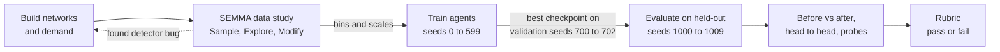
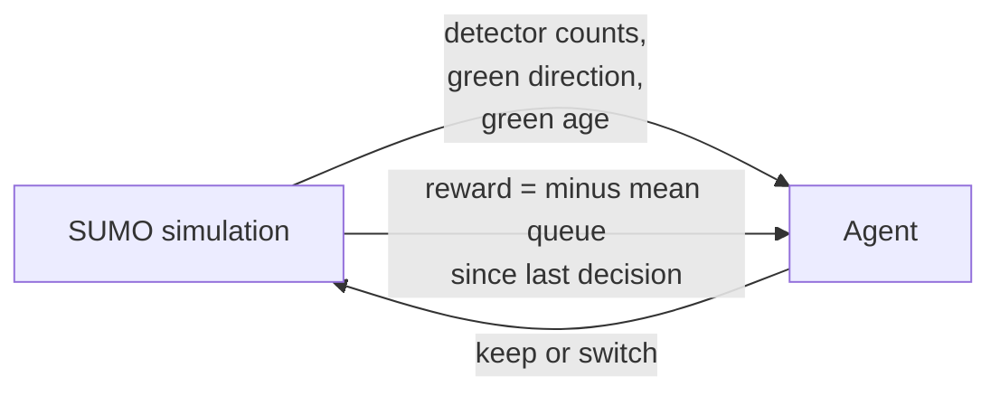
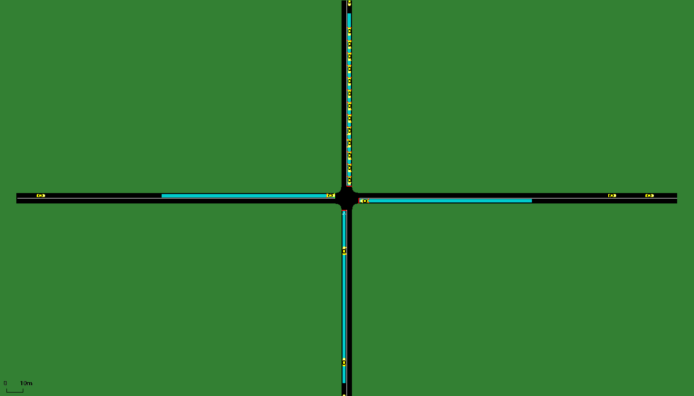
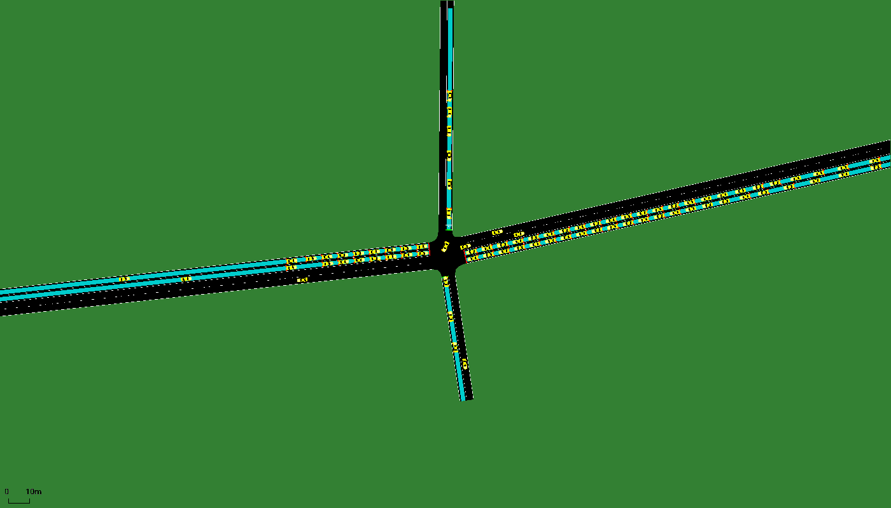
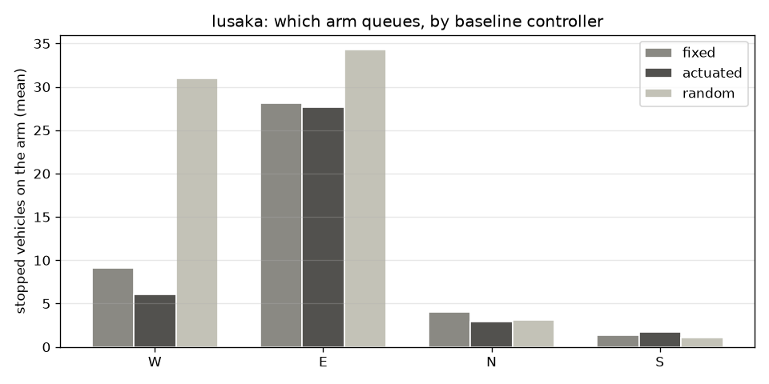
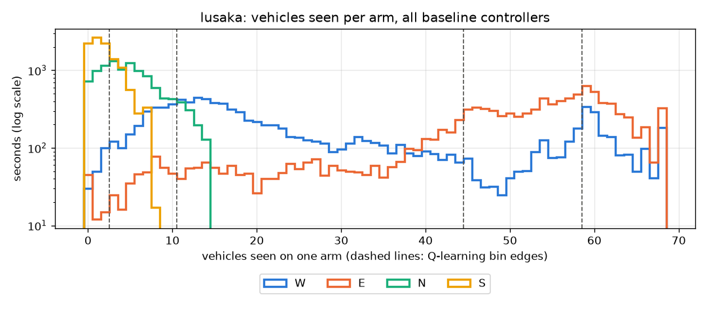
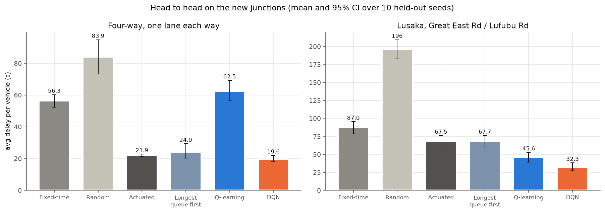
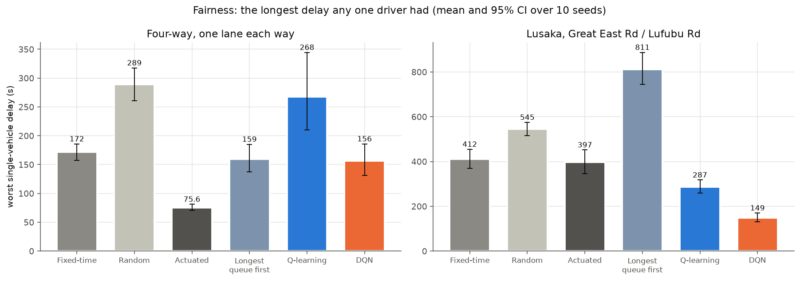
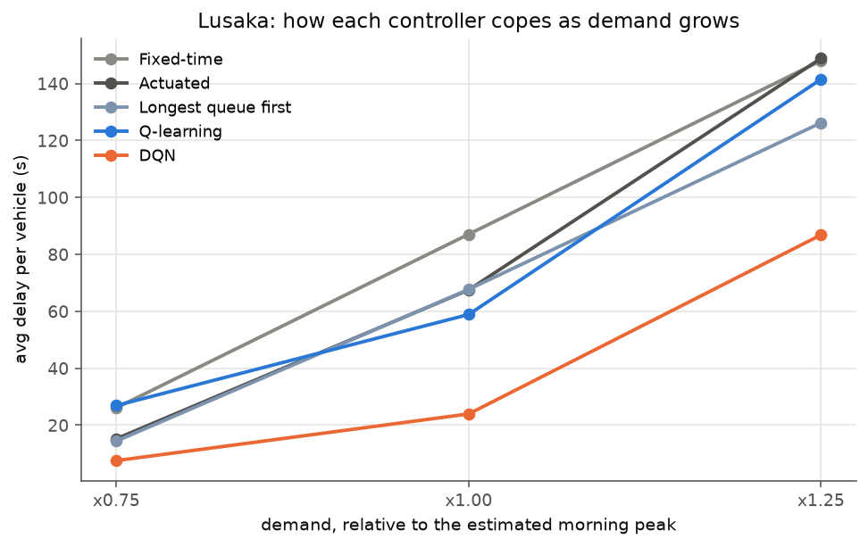
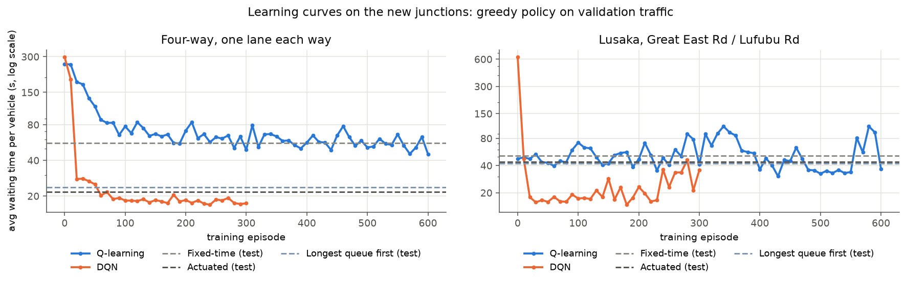

# Smart Traffic Lights with Reinforcement Learning

Traffic signals that learn when to switch, trained and tested in the SUMO
traffic simulator. This repo compares **tabular Q-learning**, a **Deep
Q-Network (DQN)** and **multi-agent Q-learning** (independent vs coordinated
intersections) against fixed-time, actuated, longest-queue-first and random
control, on traffic the agents have never seen. Part 2 moves to realistic
roads: a four-way junction with two-way traffic, and a real junction in
Lusaka, Zambia, rebuilt from OpenStreetMap.

| Scenario | Fixed-time | Best learner | Learner | vs Fixed-time | vs Actuated |
|---|---|---|---|---|---|
| Single intersection, shifting demand | 12.1 s | DQN | **3.3 s** | **-73%** | **-21%** |
| Corridor, 2 intersections, normal demand | 16.1 s | Independent Q-learning | **3.6 s** | **-78%** | +0.4% (tie) |
| Corridor, 2 intersections, heavy demand | 19.1 s | Independent Q-learning | **4.0 s** | **-79%** | **-14%** |
| Four-way junction, one lane each way (Part 2) | 56.3 s | DQN | **20.4 s** | **-64%** | **-7%** |
| Lusaka, Great East Rd / Lufubu Rd, morning peak (Part 2) | 87.0 s | DQN | **23.9 s** | **-73%** | **-65%** |

*Over 10 held-out traffic seeds. v1 rows: average waiting time per vehicle.
Part 2 rows: average delay per vehicle, which also counts time queued before
entering the road (section 8). Differences in bold have a 95% bootstrap
confidence interval that excludes zero. Full tables: [results/RESULTS.md](results/RESULTS.md).*

---

## Contents

1. [Why it matters](#1-why-it-matters)
2. [Process flow](#2-process-flow)
3. [Repository structure](#3-repository-structure)
4. [Input: the simulated world](#4-input-the-simulated-world)
5. [Data study (SEMMA)](#5-data-study-semma)
6. [Methods](#6-methods)
7. [Output and performance](#7-output-and-performance)
8. [Part 2: a real junction, four arms and a Lusaka case study](#8-part-2-a-real-junction-four-arms-and-a-lusaka-case-study)
9. [Rubric](#9-rubric)
10. [What did not work, and what we learned](#10-what-did-not-work-and-what-we-learned)
11. [Limitations and next steps](#11-limitations-and-next-steps)
12. [Reproduce](#12-reproduce)
13. [References](#13-references)

---

## 1. Why it matters

**The problem.** Most signals still run fixed timing plans. A plan tuned for
the morning peak wastes green time at noon, and it cannot react when one road
suddenly gets busy. Drivers pay for this in waiting time, fuel and emissions,
and a slow junction pushes its queue onto the next one.

**The idea.** Give every intersection a small learning agent. It reads the
same numbers a traffic camera can produce (vehicles per lane, which road has
green) and learns from experience when to keep or switch the green. Each agent
runs locally at its own junction, and neighbors can share what they see
(distributed multi-agent Q-learning, as proposed in the project write-up).

**Value proposition.** Better use of the roads a city already has, using the
cameras or detectors it already has. No new lanes, no central supercomputer.

**Who it is for.** City and regional traffic departments, smart-city pilot
programs, and traffic engineering consultancies that need a low-cost upgrade
path from fixed-time control.

**How it differs.** Fixed-time plans do not react at all. Actuated control
reacts to gaps between cars but follows hand-set rules. A learning controller
optimizes the actual goal (short queues) from data, and adapts when demand
patterns change, without an engineer re-tuning timings.

**One-year vision.** Part 2 already moves to a real Lusaka junction rebuilt
from OpenStreetMap. Next: replace the estimated demand with measured turning
counts, extend to a stretch of Great East Road with several signals, add
pedestrians, and run a shadow-mode pilot where the agent's decisions are logged
next to the real controller's before it is ever given control.

---

## 2. Process flow



Inside every training episode the agent and the simulator run the standard
reinforcement learning loop:



---

## 3. Repository structure

```
smart-traffic-light-rl/
├── traffic_rl/                 the library: one idea per file
│   ├── scenarios.py            the 5 scenarios: files, arms, detectors, action mode
│   ├── env.py                  SUMO environment: min/max green, yellow, async decisions, metrics
│   ├── runner.py               one episode loop shared by training and evaluation
│   ├── baselines.py            fixed-time, actuated, random, longest queue first + queue reward
│   ├── state.py                detector counts -> table state / DQN input (uses SEMMA config)
│   ├── q_learning.py           tabular Q-learning (independent learners on the corridor)
│   ├── dqn.py                  NumPy DQN: MLP + Adam, replay buffer, target net, Double DQN
│   ├── multi_agent.py          coordinated Q-learning: neighbor state + shared reward
│   └── metrics.py              bootstrap confidence intervals, paired differences
├── experiments/
│   ├── semma.py                data study: sample, explore, modify
│   ├── train.py                train any agent on any scenario
│   ├── evaluate.py             held-out evaluation, probes, rubric -> results/RESULTS.md
│   └── make_figures.py         every figure in this README
├── networks/
│   ├── build_networks.py       builds four_way/ and lusaka/ (left-hand traffic, phases, detectors, demand)
│   ├── single/                 1 signal, 3-lane EB and SB approaches, 6 detectors
│   ├── corridor/               2 signals 285 m apart, normal and heavy demand
│   ├── four_way/               4 two-way arms, one lane each way, split phasing
│   └── lusaka/                 Great East Rd / Lufubu Rd from OpenStreetMap, 3 demand levels
├── results/
│   ├── semma/                  sampled data, exploration figures, state_config.json
│   ├── logs/                   training and validation curves (CSV)
│   ├── models/                 trained agents (Q-tables as JSON, DQN weights as NPZ)
│   ├── figures/                result figures and sumo-gui screenshots
│   ├── evaluation.csv          every controller x every held-out seed
│   └── RESULTS.md              all tables and the rubric
├── docs/
│   ├── SEMMA.md                the data study write-up
│   └── CONCEPTS.md             a short course on every concept used here
└── tests/
    ├── test_agents.py          unit tests (Q update, gradient check, replay, LQF, statistics)
    └── test_env.py             SUMO tests (min/max green, yellow, left-hand driving, reproducibility)
```

---

## 4. Input: the simulated world

<table>
<tr>
<td></td>
<td></td>
</tr>
<tr>
<td align="center"><b>Single intersection</b> at t = 250 s. Cyan strips are the<br/>lane-area detectors, the agent's "cameras".</td>
<td align="center"><b>Corridor, heavy demand</b> at t = 400 s. Eastbound<br/>platoons leave Node2 and arrive at Node5.</td>
</tr>
</table>

| Scenario | Network | Demand (random arrivals) | Episode |
|---|---|---|---|
| `single` | 1 signal, 3 lanes per approach | EB 1500 / SB 500 veh/h, then 1000 / 1000, then 500 / 1500 | 1200 s |
| `corridor` | 2 signals, EB 3 lanes, SB 2 lanes | EB 900, SB 400 at each junction (veh/h) | 1200 s |
| `corridor_heavy` | same | EB 1400, SB 550 at each junction (veh/h) | 1200 s |

Arrivals are random (a probability of a new car every second), so each seed
is different traffic. The seed ranges never overlap: 0 to 199 (single) or
0 to 599 (corridor) for training, 700 to 702 for validation, 900 to 902 for
the SEMMA sample and 1000 to 1009 for the final test.

**The decision problem (a Markov Decision Process):**

| | Definition |
|---|---|
| State (Q-learning) | EB count bin, SB count bin, which road has green, green age bin. Coordinated agents add the neighbor's green and count bin. |
| State (DQN) | 6 lane counts / 8, green one-hot, green age / 60 (9 numbers) |
| Action | 0 keep green for 5 more seconds, 1 switch (3 s yellow, then at least 10 s green) |
| Reward | minus the mean number of stopped vehicles at the detectors since the last decision. Coordinated agents also subtract 0.5 x the neighbor's queue. |
| Constraints | minimum green 10 s, maximum green 60 s, yellow 3 s. The same rules a real controller follows. |

---

## 5. Data study (SEMMA)

Before training we studied the detector data with the **SEMMA** process
(Sample, Explore, Modify, Model, Assess). Full write-up: [docs/SEMMA.md](docs/SEMMA.md).

- **Sample:** 54,000 per-second detector readings from fixed-time, actuated and random control on all three scenarios.
- **Explore:** counts are right-skewed, demand shifts as designed, and lanes within an approach are strongly correlated (0.78).
- **Found a data bug:** the detectors ended 10 to 16 m before the stop line, so on the corridor they saw only **37%** of the real queue. After moving them to the stop line, the same run showed **108%** (slightly over 100% because detectors count cars under 1.39 m/s as stopped). This was fixed before any training.
- **Modify:** the Q-learning bin edges (2, 4, 7, 11 vehicles) are the 25th, 50th, 75th and 90th percentiles of the data. The DQN input and reward scales are the 99th percentiles.

<table>
<tr>
<td></td>
<td></td>
</tr>
</table>

---

## 6. Methods

**Tabular Q-learning** (Watkins and Dayan, 1992). A table of values Q(s, a),
updated after every decision:

```
Q(s,a) <- Q(s,a) + alpha * [ r + gamma * max_a' Q(s',a') - Q(s,a) ]      alpha = 0.1, gamma = 0.9
```

**Deep Q-Network** (Mnih et al., 2015). A neural network (9 -> 32 -> 32 -> 2,
ReLU) replaces the table, so the agent can use all six lane counts and
generalize between similar states. It uses experience replay (buffer of 20,000,
batches of 64), a target network synced every 250 updates, the Double DQN target
(van Hasselt et al., 2016) and Huber loss. Written in plain NumPy, including
backpropagation and Adam, with a unit test that checks the gradients against
finite differences.

**Multi-agent Q-learning.** One Q-learning agent per intersection.
- *Independent* (Tan, 1993): each agent sees only its own detectors.
- *Coordinated*: neighbors share which road has green and how busy they are
  (one-hop message passing), and each agent's reward includes half of its
  neighbor's queue, so it "feels" the congestion it sends downstream. This is
  the cooperative reward shaping used in networked traffic control (Chu et
  al., 2019).

**Training.** 200 episodes (single) or 600 episodes (corridor) of 20 simulated
minutes each. Epsilon-greedy exploration decays from 1.0 to 0.05 over the first
60% of episodes. Every 10 episodes the greedy policy is scored on 3 validation
seeds, and the best checkpoint is kept.

**Evaluation protocol.** Every controller runs on the same 10 held-out seeds.
Because the traffic is identical for every controller, we compare them seed by
seed (paired differences) and report 95% percentile bootstrap confidence
intervals (Efron and Tibshirani, 1993). "Before training" means the same agent
with its initial parameters, so before vs after isolates what learning added.
The agents are trained on queue length, and we also report waiting time and
travel time, which they never optimized directly.

---

## 7. Output and performance

### Before vs after training


| Scenario | Learner | Wait before | Wait after | Change |
|---|---|---|---|---|
| Single | Q-learning | 17.2 s | 3.5 s | **-79%** |
| Single | DQN | 3.7 s | 3.3 s | **-11%** |
| Corridor | Independent QL | 20.6 s | 3.6 s | **-83%** |
| Corridor | Coordinated QL | 20.6 s | 4.9 s | **-76%** |
| Corridor heavy | Independent QL | 22.6 s | 4.0 s | **-82%** |
| Corridor heavy | Coordinated QL | 22.6 s | 5.0 s | **-78%** |

An untrained Q-table has all values at zero, so it always keeps the green
until the 60 s maximum forces a switch. That is a slow fixed cycle, worse than
the 42 s fixed-time plan. The untrained DQN starts from random weights, which
happen to switch often, and that is already a decent policy at this demand.
So its gain from training is smaller (-11%) but still significant (95% CI of
the paired difference: -0.5 to -0.3 s).

### Learning curves


Greedy policy on the validation seeds during training. All learners beat
fixed-time within 10 episodes. The DQN is the smoothest learner: the network
generalizes, so one bad episode does not flip whole regions of the policy the
way it can in a table.

### Head to head (held-out traffic)


| Controller | Single | Corridor | Corridor heavy |
|---|---|---|---|
| Fixed-time | 12.1 s | 16.1 s | 19.1 s |
| Random switching | 7.7 s | 8.1 s | 10.2 s |
| Actuated (SUMO) | 4.2 s | 3.6 s | 4.7 s |
| Q-learning / Independent QL | 3.5 s | 3.6 s | **4.0 s** |
| DQN | **3.3 s** | | |
| Coordinated QL | | 4.9 s | 5.0 s |

*Average waiting time per vehicle. Travel time and queue length give the same
ranking, except that independent QL and actuated control are tied on every
metric on the normal corridor. Paired confidence intervals for each learner
against actuated control are in the
[vs Actuated table](results/RESULTS.md#trained-learners-vs-actuated-control).
Every learner serves the full demand (99.8% to 101.1% of fixed-time throughput).*

**DQN vs Q-learning.** On the single intersection the DQN is slightly better
(3.3 vs 3.5 s) and much more robust. The Q-value probes below show why: the DQN
answers 4 of 4 hand-made traffic situations correctly. The Q-table gets the two
"switch" cases right, but it never visited the two "keep" states during
training and has no answer for them, because a table cannot generalize to
states it has not seen. This is the "huge knowledge space" argument for deep
RL made concrete.

| Probe state | Right answer | Q-learning | DQN |
|---|---|---|---|
| SB busy, EB empty, EB has green | switch | switch | switch |
| EB busy, SB empty, SB has green | switch | switch | switch |
| EB busy, SB empty, EB has green | keep | never visited | keep |
| SB busy, EB empty, SB has green | keep | never visited | keep |

**Independent vs coordinated.** This is the research question from the
write-up, and the honest answer here is **no, coordination did not help**.
Coordinated agents were 1.3 s (normal) and 1.0 s (heavy) slower than
independent ones (95% CI excludes zero). Under heavy demand they did at least
match actuated control (+0.3 s, CI -0.05 to +0.66, a tie). We trained all four
corridor agents for 600 episodes instead of 200 to test whether coordination
simply needed more data. Both improved, but the gap stayed. The likely reasons:

- *State explosion.* The neighbor information multiplies the table size by
  about 10 (about 2,200 to 2,400 states vs 200 to 230, see the growth curve
  below). Each state is visited far less often, so its value estimate stays noisier.
- *The neighbor signal is weak here.* The two signals are 285 m apart and
  platoons disperse on the way, so the neighbor's current phase says little
  about arrivals in the next 5 seconds.
- *Shared reward adds noise.* Half of the neighbor's queue enters the reward,
  but the agent has only partial control over it.

This agrees with the literature: coordination pays off in dense grids and
near saturation, and it needs function approximation (e.g. a DQN per agent)
to cope with the larger state. That is the natural next step (section 11).


---

## 8. Part 2: a real junction, four arms and a Lusaka case study

The v1 networks were simplified: one-way approaches and only two arms. Part 2
asks the same questions on roads that look like real ones.

### 8.1 Why Lusaka, and why this junction

In April 2021 Lusaka City Council switched off the traffic lights at the
junction of **Great East Road and Lufubu Road**, next to East Park Mall,
because they were building up queues at peak hours (Lusaka Times, 2021). The
Council also noted that new signals in the city were often poorly
synchronised. The right turn into the mall was closed at the same time. So this is a real
place where signal control failed, which makes a fair question: *could an
adaptive signal have kept this junction working?*

Zambia drives on the **left**, so every Part 2 network is built with
`netconvert --lefthand`. Cars keep left, and the right turn is the movement
that crosses oncoming traffic. A test checks every arm of both networks.

### 8.2 The two new networks

<table>
<tr>
<td></td>
<td></td>
</tr>
<tr>
<td align="center"><b>Four-way junction</b>: every road two-way with one lane each<br/>direction. The north arm queues under fixed-time control.</td>
<td align="center"><b>Great East Rd / Lufubu Rd, Lusaka</b>: dual carriageway<br/>(2 lanes each way) with Lufubu Road (north) and the mall access (south).</td>
</tr>
</table>

| | Four-way junction | Lusaka junction |
|---|---|---|
| Geometry | 4 arms of 200 m, one lane in and one lane out each | Rebuilt from an OpenStreetMap extract: arm bearings, lane counts and speed limits (60 to 80 km/h) from OSM tags; the two carriageways joined as the crossroads it was before 2021 |
| Signal program | Split phasing: one arm green at a time (common in Zambia) | 3 greens: main road both ways (right turns give way), protected main-road right turns, side roads |
| Agent's action | Which arm to serve next (4 actions) | Which of the 3 greens to show next |
| Fixed-time plan | 30 s green + 3 s yellow per arm | 40 s / 10 s / 20 s + 3 s yellows |
| Demand | 60% straight, 20% left, 20% right; N-S heavy, then balanced, then E-W heavy | Morning peak, see the assumptions below |
| Built by | `networks/build_networks.py four_way` | `networks/build_networks.py lusaka` |

**Demand assumptions for Lusaka.** No public turning counts exist for this junction, so the demand is estimated from published numbers and standard planning factors, and then tested at ±25%:

| Quantity | Value | Source |
|---|---|---|
| Great East Road daily traffic (AADT) | about 31,000 veh/day | UNZA study of the Great East Road |
| Peak-hour share K | 0.09 | Typical urban value (Highway Capacity Manual) |
| Direction split D | 0.6 towards the city (westbound) | Typical morning-peak value (Highway Capacity Manual) |
| Great East Road peak volumes | 1,674 veh/h westbound, 1,116 eastbound | AADT × K × D |
| Lufubu Road and mall access | 300 and 200 veh/h | Assumption |
| Turning shares | Main road 85% straight, 8% left, 7% right; side roads mostly turning | Assumption |
| Sensitivity | every controller re-tested at ×0.75 and ×1.25 | Section 8.5 |

### 8.3 Data study (SEMMA) on the new junctions

The same SEMMA steps were applied to 21,600 new per-second samples. The full
write-up, with all figures, is in [docs/SEMMA.md](docs/SEMMA.md#part-2-the-four-way-and-lusaka-junctions).

- **The main-road detectors saturated.** With 105 m detectors, the Great East
  Road counts hit their ceiling (28 = 2 lanes × 14 cars) and saw only 75% of
  the queue, so the agent could not tell 28 queued cars from 60. The main road
  was re-equipped with 250 m detectors, like the advance detectors used on
  major roads. Coverage went from 75% to 123% (both regenerated by
  `experiments/semma.py`).
- **One arm dominates at Lusaka.** Under fixed-time and actuated control, the
  westbound peak arm holds about 28 stopped cars on average, against 1 to 9 on
  the others. The baselines leave 72 (actuated) to 104 (fixed-time) cars per
  episode queued outside the modelled road.

<table>
<tr>
<td></td>
<td></td>
</tr>
</table>

- **Bins from the data.** The westbound arm is either draining or backed up
  far down the road, and the Q-learning bin edges (3, 11, 45, 59) fall between
  those regimes. Each junction gets its own bins and scales in `state_config.json`.
- **Lanes of one arm move together** (correlation 0.85 within an arm, 0.12
  across arms), so the Q-learning state keeps one count per arm, as in v1.

### 8.4 A new metric: delay, not just wait

At Lusaka the queue can grow past the 300 m of modelled road, and those cars
never "enter". A controller that starves an arm could therefore *lower* the
average wait, simply by keeping cars out. So the Part 2 junctions are judged on
**average delay**: time stopped plus time queued before entering, for every
car, including those still outside at the end. Checkpoint selection during
training uses the same metric. The v1 results are unchanged: the regression
check reproduces them exactly.

### 8.5 Results



| Controller | Four-way delay | Four-way worst delay | Lusaka delay | Lusaka worst delay | Lusaka cars through |
|---|---|---|---|---|---|
| Fixed-time | 56.3 s | 172 s | 87.0 s | 412 s | 877 |
| Random | 83.9 s | 289 s | 196.3 s | 545 s | 649 |
| Actuated | 21.9 s | **76 s** | 67.5 s | 397 s | 922 |
| Longest queue first | 24.0 s | 159 s | 67.7 s | 811 s | 942 |
| Q-learning | 65.0 s | 268 s | 58.9 s | 287 s | 918 |
| **DQN** | **20.4 s** | 156 s | **23.9 s** | **149 s** | **1,000** |

*Mean over 10 held-out seeds. "Cars through" = vehicles that completed their trip in 20 minutes.*

**Before vs after training** (average delay, same seeds): Q-learning 311.5 → 65.0 s (four-way) and 95.7 → 58.9 s (Lusaka); DQN 348.3 → 20.4 s and 537.7 → 23.9 s. Every learner improved, with a 95% CI that excludes zero.

**What the numbers say:**

- **The DQN is the best controller on both junctions.** It beats actuated
  control and longest-queue-first at both, with CIs that exclude zero. At
  Lusaka it cuts average delay by 65% against actuated control
  (-43.6 s, CI -53.5 to -33.8), gets 8% more cars through, and leaves the
  fewest queued outside (21 vs 72). It also answers every hand-made logic probe
  correctly on both junctions.
- **Tabular Q-learning breaks down on four arms.** With a bin per arm, the
  table has thousands of possible states, and 600 episodes cannot fill it. It
  is statistically no better than fixed-time on the four-way. Three of its four
  probe states were never visited, so it has no answer for them. This is the
  "huge knowledge space" argument for deep Q-networks made concrete.
- **Fairness is where the story gets interesting.** The average hides the
  unlucky driver:



  - **Longest-queue-first starves Lufubu Road.** It serves the busy main road
    almost all the time. Lufubu Road cars are delayed 411 s on average, and the
    worst single delay is 811 s, about 13.5 minutes. A policy that looks fine on the average
    can be unacceptable to a whole neighbourhood.
  - **At Lusaka, the DQN is also the fairest controller** (worst delay 149 s vs 397 s for actuated).
  - **On the four-way, the DQN fails the fairness check.** Its per-arm averages
    are balanced (17 to 26 s), but its worst single delay (156 s) is twice
    actuated control's (76 s). Actuated control cycles regularly, which keeps
    the tail short. We report this as a trade-off, not a win.

**Demand sweep.** Because the Lusaka volumes are estimates, every controller was re-run at 75% and 125% of them:



The DQN stays the best at every level: 7.5 s, 23.9 s and 86.8 s of average
delay, against 15.2 s, 67.5 s and 148.8 s for actuated control. At 125% the
junction is simply over capacity, and every controller leaves a large queue
outside. So the ranking holds even though the exact volumes are uncertain.



The learning curves show one more lesson. The Lusaka DQN peaks around episode
180 and then drifts. Keeping the best checkpoint on separate validation traffic
is what protects the final model.

---

## 9. Rubric

Scored automatically by `experiments/evaluate.py`. **63 of 76 checks pass.** v1
scenarios are judged on average wait, Part 2 junctions on average delay.

| Criterion | Measure | Threshold | Result |
|---|---|---|---|
| Every learner learned (10 checks) | trained minus untrained, paired 95% CI | CI below 0 | **10 of 10 PASS** |
| Beats fixed-time (10) | paired 95% CI | CI below 0 | 9 of 10 (Q-learning on the four-way: tie) |
| Beats random switching (10) | paired 95% CI | CI below 0 | 9 of 10 (Q-learning on the four-way: tie) |
| Competitive with actuated control (10) | vs actuated, paired 95% CI | within +10% | 8 of 10 (coordinated corridor +37%, Q-learning four-way +197%) |
| Beats longest queue first (4, Part 2) | paired 95% CI | CI below 0 | 3 of 4 (Q-learning on the four-way) |
| Starves no one (4, Part 2) | worst single delay vs actuated | at most 1.25 x | 2 of 4 (both learners on the four-way) |
| Learned traffic logic (6) | hand-made probe states | all correct | **DQN 3 of 3**; Q-learning 0 of 3 (2 of 4, 0 of 4 and 2 of 3 probes, mostly never-visited states) |
| Stable learning (10) | TD loss, last 20 vs first 20 episodes | last at most 1.5 x first | **10 of 10 PASS** (all fell) |
| Coordination helps (2) | coordinated minus independent wait, 95% CI | CI below 0 | 0 of 2 (+1.3 s, +1.0 s) |
| Serves all demand (10) | vehicles completed vs fixed-time | at least 98% | 9 of 10 (Q-learning on the four-way: 94.8%) |

Every row with the per-check numbers is in [results/RESULTS.md](results/RESULTS.md#rubric).

---

## 10. What did not work, and what we learned

These dead ends are part of the result:

1. **Deciding every 0.1 s.** The first DQN (adapted from the tutorial) chose
   keep or switch at every 0.1 s step with a per-sample online update. At that
   time scale one action barely changes anything, so Q(keep) and Q(switch) were
   equal up to noise. The trained policy was *worse than an untrained network*
   on held-out traffic. Adding replay and a target network alone did not fix it.
   The fix was the decision model: decide only when a switch is allowed, then
   every 5 s. That is the standard in traffic signal RL.
2. **Detectors that missed the queue.** Found by the SEMMA data study (section 5).
3. **Greedy lock-in in the Q-table.** Early trained Q-tables sometimes kept one
   green for the whole 20 minutes on a test seed (197 s average wait). In a
   rarely visited state, both Q-values were still near their zero start, "keep"
   led back into the same state, and a greedy agent never escaped. Exploration
   had hidden this during training. The fix was a 60 s maximum green, a rule
   every real controller has and the actuated baseline already used.
4. **Port clashes in parallel runs.** Several runs connecting to SUMO over
   TraCI sockets occasionally picked the same port and crashed. Switching to
   `libsumo` (SUMO inside the Python process) removed the ports and made
   episodes 7.6x faster, with identical results.
5. **A metric that could reward starvation.** Average wait only counts cars
   that entered the modelled road. At Lusaka a controller could push its queue
   outside and look better. Found while checking a result that seemed too good.
   The fix was total delay, for evaluation and for checkpoint selection
   (section 8.4). The good result survived the stricter metric.
6. **Detectors too short for a dual carriageway.** 105 m was enough for the v1
   junctions but saturated on Great East Road. Found by SEMMA (section 8.3).
7. **Split phasing does not suit a busy dual carriageway.** Serving one arm at a
   time would oversaturate Great East Road at about 1,700 veh/h. The Lusaka
   junction uses the realistic main road / right turns / side roads program
   instead.

---

## 11. Limitations and next steps

- **Lusaka demand is estimated**, not counted: published daily volume, standard
  peak factors and assumed side-road volumes and turning shares. The ×0.75 /
  ×1.25 sweep shows the ranking holds, but real turning counts from the
  Council or a video survey are the most valuable next step.
- **Only the junction itself is modelled**: 300 m arms, with no neighbouring
  junctions, minibus stops, informal parking or pedestrians. Each affects real
  capacity on Great East Road.
- **Detector reach on the four-way.** The 105 m single-lane detectors sometimes
  fill up (14 cars) on the busy north arm, so the agent then sees only part of
  the queue. Coverage is still 93%, but longer detectors may help there too.
- **Simulated detectors.** Real cameras add noise, occlusion and delay; the
  agent should be trained with noisy counts before any field test.
- **The DQN's worst-case delay** on the four-way is twice actuated control's.
  A fairness term in the reward (e.g. penalising the longest wait) is the
  obvious next experiment.
- **Coordination used tabular agents.** Next: one DQN per intersection with the
  neighbor features as extra inputs, on a stretch of Great East Road with
  several signals.

---

## 12. Reproduce

Python 3.10 or newer. SUMO installs through pip; no separate install is needed.

```bash
python -m venv .venv
source .venv/Scripts/activate   # Windows Git Bash (Linux/macOS: source .venv/bin/activate)
pip install -r requirements.txt
```

```bash
python -m pytest tests                                              # unit tests, no SUMO needed
python experiments/semma.py                                         # data study (about 2 min)
python experiments/train.py --agent q_learning  --scenario single   --episodes 200
python experiments/train.py --agent dqn         --scenario single   --episodes 200
python experiments/train.py --agent q_learning  --scenario corridor --episodes 600
python experiments/train.py --agent coordinated --scenario corridor --episodes 600
python experiments/train.py --agent q_learning  --scenario corridor_heavy --episodes 600
python experiments/train.py --agent coordinated --scenario corridor_heavy --episodes 600
python experiments/train.py --agent q_learning  --scenario four_way --episodes 600
python experiments/train.py --agent dqn         --scenario four_way --episodes 300
python experiments/train.py --agent q_learning  --scenario lusaka   --episodes 600
python experiments/train.py --agent dqn         --scenario lusaka   --episodes 300
python experiments/evaluate.py                                      # results/RESULTS.md
python experiments/make_figures.py                                  # results/figures/
```

The Part 2 networks are already in `networks/`. To rebuild them from the
node/edge definitions and the committed OpenStreetMap extract:

```bash
python networks/build_networks.py
```

Each training run takes a few minutes with libsumo, and the runs can go in
parallel. Everything is seeded, so the numbers should match `results/` exactly
with SUMO 1.27.1.

---

## 13. References

- Watkins, C. and Dayan, P. (1992). Q-learning. *Machine Learning*, 8, 279-292.
- Tan, M. (1993). Multi-agent reinforcement learning: independent vs. cooperative agents. *ICML*.
- Efron, B. and Tibshirani, R. (1993). *An Introduction to the Bootstrap*. Chapman and Hall.
- Mnih, V. et al. (2015). Human-level control through deep reinforcement learning. *Nature*, 518, 529-533.
- van Hasselt, H., Guez, A. and Silver, D. (2016). Deep reinforcement learning with double Q-learning. *AAAI*.
- Lopez, P. A. et al. (2018). Microscopic traffic simulation using SUMO. *IEEE ITSC*.
- Wei, H., Zheng, G., Yao, H. and Li, Z. (2018). IntelliLight: a reinforcement learning approach for intelligent traffic light control. *KDD*.
- Chu, T., Wang, J., Codeca, L. and Li, Z. (2019). Multi-agent deep reinforcement learning for large-scale traffic signal control. *IEEE Transactions on Intelligent Transportation Systems*, 21(3).
- Wei, H., Zheng, G., Gayah, V. and Li, Z. (2019). A survey on traffic signal control methods. arXiv:1904.08117.
- Sutton, R. and Barto, A. (2018). *Reinforcement Learning: An Introduction*, 2nd ed. MIT Press.
- SAS Institute. SEMMA data mining methodology.
- Varaiya, P. (2013). Max pressure control of a network of signalized intersections. *Transportation Research Part C*, 36, 177-195.
- Transportation Research Board (2022). *Highway Capacity Manual*, 7th ed. (peak-hour K and directional D factors).
- Lusaka Times (23 April 2021). LCC "switches off" robots at Great East and Lufubu roads.
- University of Zambia. Quality of public transport service in the city of Lusaka: a case study of the minibus service on the Great East Road (daily volume on Great East Road). UNZA repository.
- OpenStreetMap contributors. Map data for the Lusaka junction, ODbL. https://www.openstreetmap.org/copyright

Built on the RoadwayVR SUMO tutorial (MIT); see [NOTICE.md](NOTICE.md). Map data © OpenStreetMap contributors (ODbL). Licensed under MIT.
