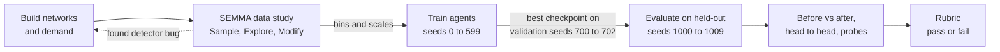
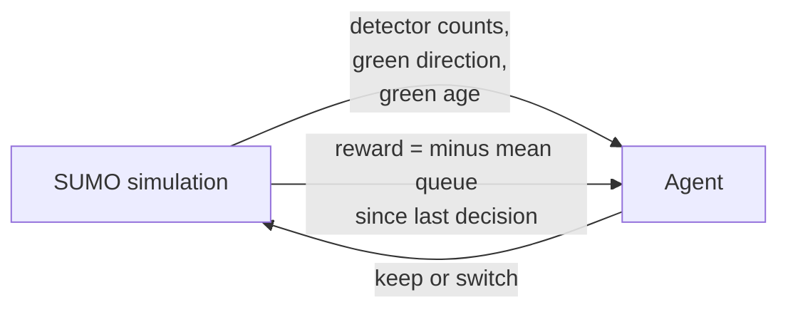
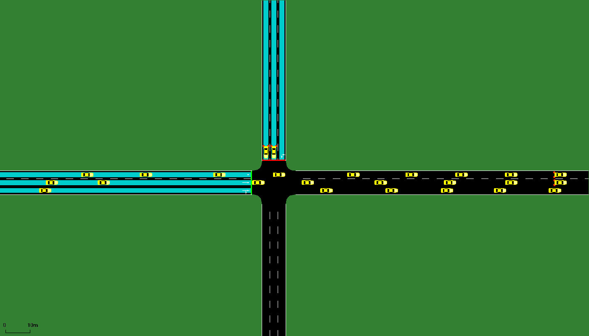
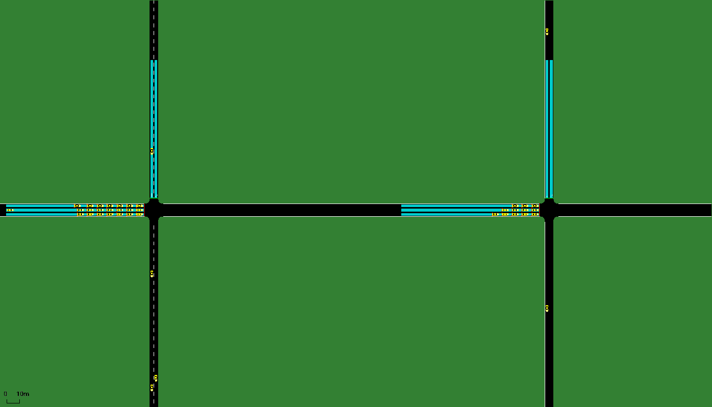
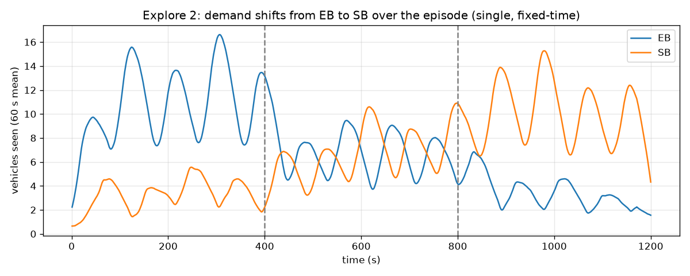
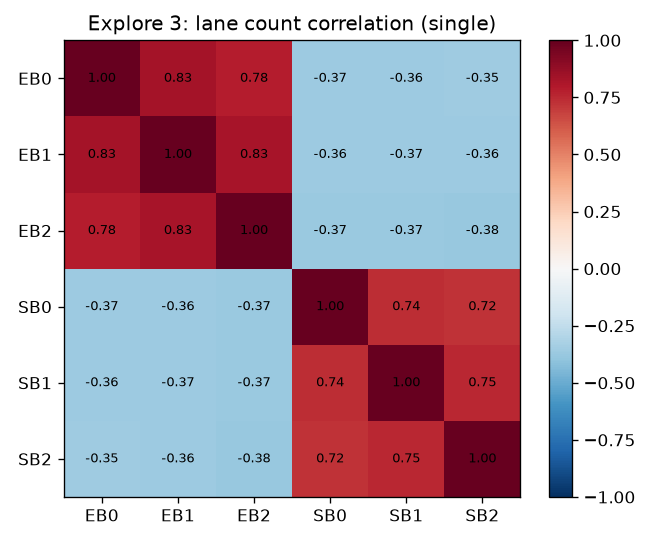
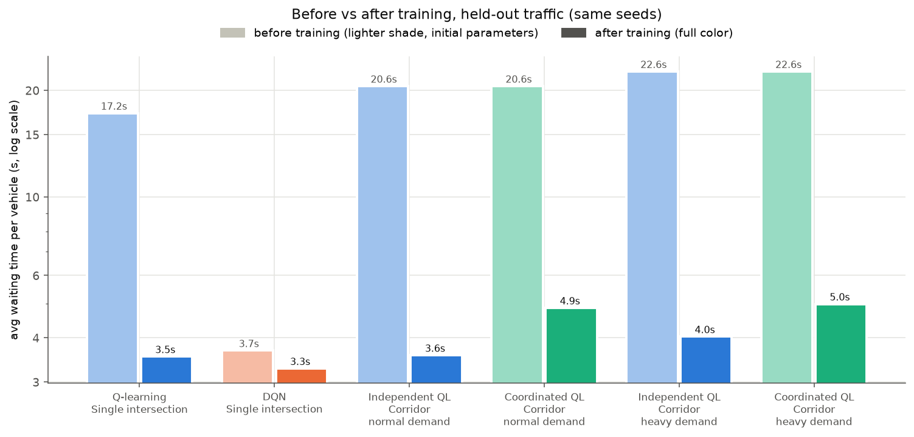
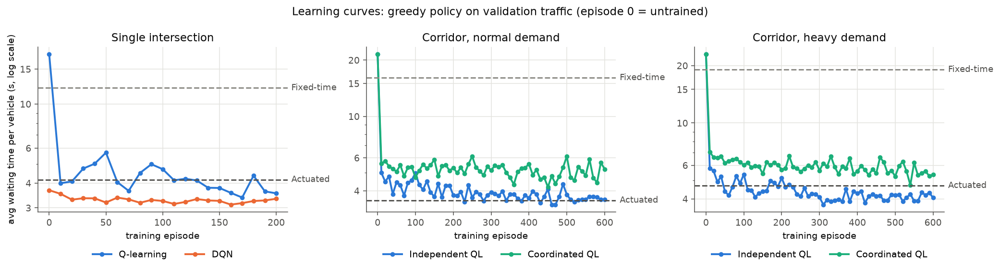
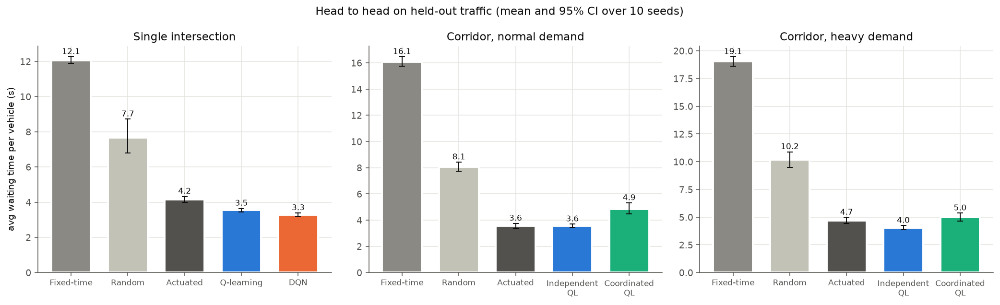
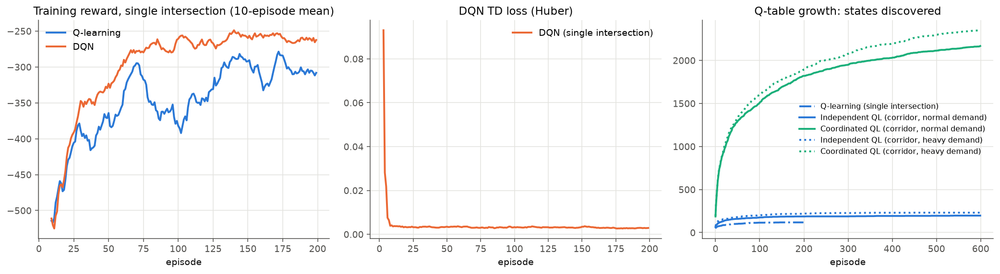

# Smart Traffic Lights with Reinforcement Learning

Traffic signals that learn when to switch, trained and tested in the SUMO
traffic simulator. This repo compares **tabular Q-learning**, a **Deep
Q-Network (DQN)** and **multi-agent Q-learning** (independent vs coordinated
intersections) against fixed-time, actuated and random control, on traffic
the agents have never seen.

| Scenario | Fixed-time wait | Best learner | Its wait | vs Fixed-time | vs Actuated |
|---|---|---|---|---|---|
| Single intersection, shifting demand | 12.1 s | DQN | **3.3 s** | **-73%** | **-21%** |
| Corridor, 2 intersections, normal demand | 16.1 s | Independent Q-learning | **3.6 s** | **-78%** | +0.4% (tie) |
| Corridor, 2 intersections, heavy demand | 19.1 s | Independent Q-learning | **4.0 s** | **-79%** | **-14%** |

*Average waiting time per vehicle over 10 held-out traffic seeds. All differences
marked in bold have a 95% bootstrap confidence interval that excludes zero.
Full tables: [results/RESULTS.md](results/RESULTS.md).*

---

## Contents

1. [Why it matters](#1-why-it-matters)
2. [Process flow](#2-process-flow)
3. [Repository structure](#3-repository-structure)
4. [Input: the simulated world](#4-input-the-simulated-world)
5. [Data study (SEMMA)](#5-data-study-semma)
6. [Methods](#6-methods)
7. [Output and performance](#7-output-and-performance)
8. [Rubric](#8-rubric)
9. [What did not work, and what we learned](#9-what-did-not-work-and-what-we-learned)
10. [Limitations and next steps](#10-limitations-and-next-steps)
11. [Reproduce](#11-reproduce)
12. [References](#12-references)

---

## 1. Why it matters

**The problem.** Most signals still run fixed timing plans. A plan tuned for
the morning peak wastes green time at noon, and it cannot react when one road
suddenly gets busy. Drivers pay for this in waiting time, fuel and emissions,
and a slow junction pushes its queue onto the next one.

**The idea.** Give every intersection a small learning agent. It reads the
same numbers a traffic camera can produce (vehicles per lane, which road has
green) and learns from experience when to keep or switch the green. Each agent
runs locally at its own junction, and neighbors can share what they see
(distributed multi-agent Q-learning, as proposed in the project write-up).

**Value proposition.** Better use of the roads a city already has, using the
cameras or detectors it already has. No new lanes, no central supercomputer.

**Who it is for.** City and regional traffic departments, smart-city pilot
programs, and traffic engineering consultancies that need a low-cost upgrade
path from fixed-time control.

**How it differs.** Fixed-time plans do not react at all. Actuated control
reacts to gaps between cars but follows hand-set rules. A learning controller
optimizes the actual goal (short queues) from data, and adapts when demand
patterns change, without an engineer re-tuning timings.

**One-year vision.** Move from synthetic networks to a real district map from
OpenStreetMap with measured traffic counts, add pedestrians, and run a
shadow-mode pilot where the agent's decisions are logged next to the real
controller's before it is ever given control.

---

## 2. Process flow



Inside every training episode the agent and the simulator run the standard
reinforcement learning loop:



---

## 3. Repository structure

```
smart-traffic-light-rl/
├── traffic_rl/                 the library: one idea per file
│   ├── scenarios.py            the 3 scenarios: files, agents, detectors
│   ├── env.py                  SUMO environment: min/max green, yellow, async decisions, metrics
│   ├── runner.py               one episode loop shared by training and evaluation
│   ├── baselines.py            fixed-time, actuated, random controllers + queue reward
│   ├── state.py                detector counts -> table state / DQN input (uses SEMMA config)
│   ├── q_learning.py           tabular Q-learning (independent learners on the corridor)
│   ├── dqn.py                  NumPy DQN: MLP + Adam, replay buffer, target net, Double DQN
│   ├── multi_agent.py          coordinated Q-learning: neighbor state + shared reward
│   └── metrics.py              bootstrap confidence intervals, paired differences
├── experiments/
│   ├── semma.py                data study: sample, explore, modify
│   ├── train.py                train any agent on any scenario
│   ├── evaluate.py             held-out evaluation, probes, rubric -> results/RESULTS.md
│   └── make_figures.py         every figure in this README
├── networks/
│   ├── single/                 1 signal, 3-lane EB and SB approaches, 6 detectors
│   └── corridor/               2 signals 285 m apart, normal and heavy demand
├── results/
│   ├── semma/                  sampled data, exploration figures, state_config.json
│   ├── logs/                   training and validation curves (CSV)
│   ├── models/                 trained agents (Q-tables as JSON, DQN weights as NPZ)
│   ├── figures/                result figures and sumo-gui screenshots
│   ├── evaluation.csv          every controller x every held-out seed
│   └── RESULTS.md              all tables and the rubric
├── docs/
│   ├── SEMMA.md                the data study write-up
│   └── CONCEPTS.md             a short course on every concept used here
└── tests/test_agents.py        unit tests (Q update, gradient check, replay, statistics)
```

---

## 4. Input: the simulated world

<table>
<tr>
<td></td>
<td></td>
</tr>
<tr>
<td align="center"><b>Single intersection</b> at t = 250 s. Cyan strips are the<br/>lane-area detectors, the agent's "cameras".</td>
<td align="center"><b>Corridor, heavy demand</b> at t = 400 s. Eastbound<br/>platoons leave Node2 and arrive at Node5.</td>
</tr>
</table>

| Scenario | Network | Demand (random arrivals) | Episode |
|---|---|---|---|
| `single` | 1 signal, 3 lanes per approach | EB 1500 / SB 500 veh/h, then 1000 / 1000, then 500 / 1500 | 1200 s |
| `corridor` | 2 signals, EB 3 lanes, SB 2 lanes | EB 900, SB 400 at each junction (veh/h) | 1200 s |
| `corridor_heavy` | same | EB 1400, SB 550 at each junction (veh/h) | 1200 s |

Arrivals are random (a probability of a new car every second), so each seed
is different traffic. The seed ranges never overlap: 0 to 199 (single) or
0 to 599 (corridor) for training, 700 to 702 for validation, 900 to 902 for
the SEMMA sample and 1000 to 1009 for the final test.

**The decision problem (a Markov Decision Process):**

| | Definition |
|---|---|
| State (Q-learning) | EB count bin, SB count bin, which road has green, green age bin. Coordinated agents add the neighbor's green and count bin. |
| State (DQN) | 6 lane counts / 8, green one-hot, green age / 60 (9 numbers) |
| Action | 0 keep green for 5 more seconds, 1 switch (3 s yellow, then at least 10 s green) |
| Reward | minus the mean number of stopped vehicles at the detectors since the last decision. Coordinated agents also subtract 0.5 x the neighbor's queue. |
| Constraints | minimum green 10 s, maximum green 60 s, yellow 3 s. The same rules a real controller follows. |

---

## 5. Data study (SEMMA)

Before training we studied the detector data with the **SEMMA** process
(Sample, Explore, Modify, Model, Assess). Full write-up: [docs/SEMMA.md](docs/SEMMA.md).

- **Sample:** 54,000 per-second detector readings from fixed-time, actuated and random control on all three scenarios.
- **Explore:** counts are right-skewed, demand shifts as designed, and lanes within an approach are strongly correlated (0.78).
- **Found a data bug:** the detectors ended 10 to 16 m before the stop line, so on the corridor they saw only **37%** of the real queue. After moving them to the stop line, the same run showed **108%** (slightly over 100% because detectors count cars under 1.39 m/s as stopped). This was fixed before any training.
- **Modify:** the Q-learning bin edges (2, 4, 7, 11 vehicles) are the 25th, 50th, 75th and 90th percentiles of the data. The DQN input and reward scales are the 99th percentiles.

<table>
<tr>
<td></td>
<td></td>
</tr>
</table>

---

## 6. Methods

**Tabular Q-learning** (Watkins and Dayan, 1992). A table of values Q(s, a),
updated after every decision:

```
Q(s,a) <- Q(s,a) + alpha * [ r + gamma * max_a' Q(s',a') - Q(s,a) ]      alpha = 0.1, gamma = 0.9
```

**Deep Q-Network** (Mnih et al., 2015). A neural network (9 -> 32 -> 32 -> 2,
ReLU) replaces the table, so the agent can use all six lane counts and
generalize between similar states. It uses experience replay (buffer of 20,000,
batches of 64), a target network synced every 250 updates, the Double DQN target
(van Hasselt et al., 2016) and Huber loss. Written in plain NumPy, including
backpropagation and Adam, with a unit test that checks the gradients against
finite differences.

**Multi-agent Q-learning.** One Q-learning agent per intersection.
- *Independent* (Tan, 1993): each agent sees only its own detectors.
- *Coordinated*: neighbors share which road has green and how busy they are
  (one-hop message passing), and each agent's reward includes half of its
  neighbor's queue, so it "feels" the congestion it sends downstream. This is
  the cooperative reward shaping used in networked traffic control (Chu et
  al., 2019).

**Training.** 200 episodes (single) or 600 episodes (corridor) of 20 simulated
minutes each. Epsilon-greedy exploration decays from 1.0 to 0.05 over the first
60% of episodes. Every 10 episodes the greedy policy is scored on 3 validation
seeds, and the best checkpoint is kept.

**Evaluation protocol.** Every controller runs on the same 10 held-out seeds.
Because the traffic is identical for every controller, we compare them seed by
seed (paired differences) and report 95% percentile bootstrap confidence
intervals (Efron and Tibshirani, 1993). "Before training" means the same agent
with its initial parameters, so before vs after isolates what learning added.
The agents are trained on queue length, and we also report waiting time and
travel time, which they never optimized directly.

---

## 7. Output and performance

### Before vs after training



| Scenario | Learner | Wait before | Wait after | Change |
|---|---|---|---|---|
| Single | Q-learning | 17.2 s | 3.5 s | **-79%** |
| Single | DQN | 3.7 s | 3.3 s | **-11%** |
| Corridor | Independent QL | 20.6 s | 3.6 s | **-83%** |
| Corridor | Coordinated QL | 20.6 s | 4.9 s | **-76%** |
| Corridor heavy | Independent QL | 22.6 s | 4.0 s | **-82%** |
| Corridor heavy | Coordinated QL | 22.6 s | 5.0 s | **-78%** |

An untrained Q-table has all values at zero, so it always keeps the green
until the 60 s maximum forces a switch. That is a slow fixed cycle, worse than
the 42 s fixed-time plan. The untrained DQN starts from random weights, which
happen to switch often, and that is already a decent policy at this demand.
So its gain from training is smaller (-11%) but still significant (95% CI of
the paired difference: -0.5 to -0.3 s).

### Learning curves



Greedy policy on the validation seeds during training. All learners beat
fixed-time within 10 episodes. The DQN is the smoothest learner: the network
generalizes, so one bad episode does not flip whole regions of the policy the
way it can in a table.

### Head to head (held-out traffic)



| Controller | Single | Corridor | Corridor heavy |
|---|---|---|---|
| Fixed-time | 12.1 s | 16.1 s | 19.1 s |
| Random switching | 7.7 s | 8.1 s | 10.2 s |
| Actuated (SUMO) | 4.2 s | 3.6 s | 4.7 s |
| Q-learning / Independent QL | 3.5 s | 3.6 s | **4.0 s** |
| DQN | **3.3 s** | | |
| Coordinated QL | | 4.9 s | 5.0 s |

*Average waiting time per vehicle. Travel time and queue length give the same
ranking, except that independent QL and actuated control are tied on every
metric on the normal corridor. Paired confidence intervals for each learner
against actuated control are in the
[vs Actuated table](results/RESULTS.md#trained-learners-vs-actuated-control).
Every learner serves the full demand (99.8% to 101.1% of fixed-time throughput).*

**DQN vs Q-learning.** On the single intersection the DQN is slightly better
(3.3 vs 3.5 s) and much more robust. The Q-value probes below show why: the DQN
answers 4 of 4 hand-made traffic situations correctly. The Q-table gets the two
"switch" cases right, but it never visited the two "keep" states during
training and has no answer for them, because a table cannot generalize to
states it has not seen. This is the "huge knowledge space" argument for deep
RL made concrete.

| Probe state | Right answer | Q-learning | DQN |
|---|---|---|---|
| SB busy, EB empty, EB has green | switch | switch | switch |
| EB busy, SB empty, SB has green | switch | switch | switch |
| EB busy, SB empty, EB has green | keep | never visited | keep |
| SB busy, EB empty, SB has green | keep | never visited | keep |

**Independent vs coordinated.** This is the research question from the
write-up, and the honest answer here is **no, coordination did not help**.
Coordinated agents were 1.3 s (normal) and 1.0 s (heavy) slower than
independent ones (95% CI excludes zero). Under heavy demand they did at least
match actuated control (+0.3 s, CI -0.05 to +0.66, a tie). We trained all four
corridor agents for 600 episodes instead of 200 to test whether coordination
simply needed more data. Both improved, but the gap stayed. The likely reasons:

- *State explosion.* The neighbor information multiplies the table size by
  about 10 (about 2,200 to 2,400 states vs 200 to 230, see the growth curve
  below). Each state is visited far less often, so its value estimate stays noisier.
- *The neighbor signal is weak here.* The two signals are 285 m apart and
  platoons disperse on the way, so the neighbor's current phase says little
  about arrivals in the next 5 seconds.
- *Shared reward adds noise.* Half of the neighbor's queue enters the reward,
  but the agent has only partial control over it.

This agrees with the literature: coordination pays off in dense grids and
near saturation, and it needs function approximation (e.g. a DQN per agent)
to cope with the larger state. That is the natural next step (section 10).



---

## 8. Rubric

Scored automatically by `experiments/evaluate.py`. **36 of 40 checks pass.**

| Criterion | Measure | Threshold | Result |
|---|---|---|---|
| Every learner learned (6 checks) | avg wait, trained minus untrained, paired 95% CI | CI below 0 | **6 of 6 PASS** |
| Every learner beats fixed-time (6) | avg wait, paired 95% CI | CI below 0 | **6 of 6 PASS** |
| Every learner beats random switching (6) | avg wait, paired 95% CI | CI below 0 | **6 of 6 PASS** |
| Competitive with actuated control (6) | avg wait vs actuated, paired 95% CI | within +10% | 5 of 6 (coordinated on the normal corridor: +37%) |
| Learned traffic logic (2) | 4 hand-made probe states | 4 of 4 | DQN PASS, Q-learning FAIL (2 of 4) |
| Stable learning (6) | TD loss, last 20 vs first 20 episodes | last at most 1.5 x first | **6 of 6 PASS** (all fell) |
| Coordination helps (2) | coordinated minus independent wait, 95% CI | CI below 0 | 0 of 2 (+1.3 s, +1.0 s) |
| Serves all demand (6) | vehicles completed vs fixed-time | at least 98% | **6 of 6 PASS** |

Every row with the per-check numbers is in [results/RESULTS.md](results/RESULTS.md#rubric).

---

## 9. What did not work, and what we learned

These dead ends are part of the result:

1. **Deciding every 0.1 s.** The first DQN (adapted from the tutorial) chose
   keep or switch at every 0.1 s step with a per-sample online update. At that
   time scale one action barely changes anything, so Q(keep) and Q(switch) were
   equal up to noise. The trained policy was *worse than an untrained network*
   on held-out traffic. Adding replay and a target network alone did not fix it.
   The fix was the decision model: decide only when a switch is allowed, then
   every 5 s. That is the standard in traffic signal RL.
2. **Detectors that missed the queue.** Found by the SEMMA data study (section 5).
3. **Greedy lock-in in the Q-table.** Early trained Q-tables sometimes kept one
   green for the whole 20 minutes on a test seed (197 s average wait). In a
   rarely visited state, both Q-values were still near their zero start, "keep"
   led back into the same state, and a greedy agent never escaped. Exploration
   had hidden this during training. The fix was a 60 s maximum green, a rule
   every real controller has and the actuated baseline already used.
4. **Port clashes in parallel runs.** Several runs connecting to SUMO over
   TraCI sockets occasionally picked the same port and crashed. Switching to
   `libsumo` (SUMO inside the Python process) removed the ports and made
   episodes 7.6x faster, with identical results.

---

## 10. Limitations and next steps

- Synthetic networks with two approaches and two phases. Next: a real
  OpenStreetMap district with turning movements and 4 to 8 phases.
- Simulated detectors. Real cameras add noise, occlusion and delay; the agent
  should be trained with noisy counts before any field test.
- No pedestrians (left out on purpose in the write-up, needed before deployment).
- Coordination used tabular agents. Next: one DQN per intersection with the
  neighbor features as extra inputs, and a grid of 4 or more junctions where
  spillback between junctions is common.
- Demand levels were chosen by hand. A sweep from light to saturated traffic
  would show where each method starts to fail.

---

## 11. Reproduce

Python 3.10 or newer. SUMO installs through pip; no separate install is needed.

```bash
python -m venv .venv
source .venv/Scripts/activate   # Windows Git Bash (Linux/macOS: source .venv/bin/activate)
pip install -r requirements.txt
```

```bash
python -m pytest tests                                              # unit tests, no SUMO needed
python experiments/semma.py                                         # data study (about 2 min)
python experiments/train.py --agent q_learning  --scenario single   --episodes 200
python experiments/train.py --agent dqn         --scenario single   --episodes 200
python experiments/train.py --agent q_learning  --scenario corridor --episodes 600
python experiments/train.py --agent coordinated --scenario corridor --episodes 600
python experiments/train.py --agent q_learning  --scenario corridor_heavy --episodes 600
python experiments/train.py --agent coordinated --scenario corridor_heavy --episodes 600
python experiments/evaluate.py                                      # results/RESULTS.md
python experiments/make_figures.py                                  # results/figures/
```

Each training run takes a few minutes with libsumo, and the runs can go in
parallel. Everything is seeded, so the numbers should match `results/` exactly
with SUMO 1.27.1.

---

## 12. References

- Watkins, C. and Dayan, P. (1992). Q-learning. *Machine Learning*, 8, 279-292.
- Tan, M. (1993). Multi-agent reinforcement learning: independent vs. cooperative agents. *ICML*.
- Efron, B. and Tibshirani, R. (1993). *An Introduction to the Bootstrap*. Chapman and Hall.
- Mnih, V. et al. (2015). Human-level control through deep reinforcement learning. *Nature*, 518, 529-533.
- van Hasselt, H., Guez, A. and Silver, D. (2016). Deep reinforcement learning with double Q-learning. *AAAI*.
- Lopez, P. A. et al. (2018). Microscopic traffic simulation using SUMO. *IEEE ITSC*.
- Wei, H., Zheng, G., Yao, H. and Li, Z. (2018). IntelliLight: a reinforcement learning approach for intelligent traffic light control. *KDD*.
- Chu, T., Wang, J., Codeca, L. and Li, Z. (2019). Multi-agent deep reinforcement learning for large-scale traffic signal control. *IEEE Transactions on Intelligent Transportation Systems*, 21(3).
- Wei, H., Zheng, G., Gayah, V. and Li, Z. (2019). A survey on traffic signal control methods. arXiv:1904.08117.
- Sutton, R. and Barto, A. (2018). *Reinforcement Learning: An Introduction*, 2nd ed. MIT Press.
- SAS Institute. SEMMA data mining methodology.

Built on the RoadwayVR SUMO tutorial (MIT); see [NOTICE.md](NOTICE.md). Licensed under MIT.
