# Smart Traffic Lights with Reinforcement Learning

Traffic signals that learn when to switch, trained and tested in the SUMO
traffic simulator. This repo compares **tabular Q-learning**, a **Deep
Q-Network (DQN)** and **multi-agent Q-learning** (independent vs coordinated
intersections) against fixed-time (hand-set, and properly timed with
Webster's method), actuated, longest-queue-first and random control, on traffic
the agents have never seen. Every learner is trained in 5 independent runs, and
the results cover all 5. Part 2 moves to realistic
roads: a four-way junction with two-way traffic, and a real junction in
Lusaka, Zambia, rebuilt from OpenStreetMap.

| Scenario | Webster fixed-time | Actuated | Best learner | Learner | vs Webster | vs Actuated |
|---|---|---|---|---|---|---|
| Single intersection, shifting demand | 3.8 s | 4.0 s | DQN | **3.2 s** | **-14%** | **-20%** |
| Corridor, 2 intersections, normal demand | **3.2 s** | 3.6 s | Independent Q-learning | 3.5 s | **+10%** (worse) | -1% (tie) |
| Corridor, 2 intersections, heavy demand | 3.8 s | 4.7 s | Independent Q-learning | 3.9 s | +3% (tie) | **-16%** |
| Four-way junction, one lane each way (Part 2) | 77.1 s | 21.6 s | DQN | **19.3 s** | **-75%** | **-11%** |
| Lusaka, Great East Rd / Lufubu Rd, morning peak (Part 2) | 132.5 s | 98.0 s | DQN | **40.2 s** | **-70%** | **-59%** |

*Mean over 5 independent training runs and 10 held-out traffic seeds, after a
300 s warm-up. v1 rows: average waiting time per vehicle. Part 2 rows: average
delay per vehicle, which also counts time queued before entering the road
(section 8). Differences in bold have a 95% confidence interval, over both
training runs and traffic seeds, that excludes zero. "Webster" is a fixed-time
plan timed properly from measured saturation flows; the hand-set plans are much
weaker (12.1 to 132.5 s). Full tables: [results/RESULTS.md](results/RESULTS.md).*

**In short.** Against a properly timed fixed plan, reinforcement learning earns
its place where traffic is uneven or shifts: the DQN beats every baseline on the
single intersection, the four-way junction and the Lusaka junction. On the
steady two-signal corridor, Webster's plan is as good as or better than every
learner.

---

## Contents

1. [Why it matters](#1-why-it-matters)
2. [Process flow](#2-process-flow)
3. [Repository structure](#3-repository-structure)
4. [Input: the simulated world](#4-input-the-simulated-world)
5. [Data study (SEMMA)](#5-data-study-semma)
6. [Methods](#6-methods)
7. [Output and performance](#7-output-and-performance)
8. [Part 2: a real junction, four arms and a Lusaka case study](#8-part-2-a-real-junction-four-arms-and-a-lusaka-case-study)
9. [Rubric](#9-rubric)
10. [What did not work, and what we learned](#10-what-did-not-work-and-what-we-learned)
11. [Limitations and next steps](#11-limitations-and-next-steps)
12. [Reproduce](#12-reproduce)
13. [References](#13-references)

---

## 1. Why it matters

**The problem.** Most signals still run fixed timing plans. A plan tuned for
the morning peak wastes green time at noon, and it cannot react when one road
suddenly gets busy. Drivers pay for this in waiting time, fuel and emissions,
and a slow junction pushes its queue onto the next one.

**The idea.** Give every intersection a small learning agent. It reads the
same numbers a traffic camera can produce (vehicles per lane, which road has
green) and learns from experience when to keep or switch the green. Each agent
runs locally at its own junction, and neighbors can share what they see
(distributed multi-agent Q-learning, as proposed in the project write-up).

**Value proposition.** Better use of the roads a city already has, using the
cameras or detectors it already has. No new lanes, no central supercomputer.

**Who it is for.** City and regional traffic departments, smart-city pilot
programs, and traffic engineering consultancies that need a low-cost upgrade
path from fixed-time control.

**How it differs.** Fixed-time plans do not react at all. Actuated control
reacts to gaps between cars but follows hand-set rules. A learning controller
optimizes the actual goal (short queues) from data, and adapts when demand
patterns change, without an engineer re-tuning timings.

**One-year vision.** Part 2 already moves to a real Lusaka junction rebuilt
from OpenStreetMap. Next: replace the estimated demand with measured turning
counts, extend to a stretch of Great East Road with several signals, add
pedestrians, and run a shadow-mode pilot where the agent's decisions are logged
next to the real controller's before it is ever given control.

---

## 2. Process flow

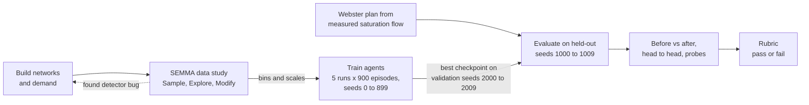
```mermaid
flowchart LR
    A[Build networks<br/>and demand] --> B[SEMMA data study<br/>Sample, Explore, Modify]
    B -->|bins and scales| C[Train agents<br/>5 runs x 900 episodes,<br/>seeds 0 to 899]
    W[Webster plan from<br/>measured saturation flow] --> D
    C -->|best checkpoint on<br/>validation seeds 2000 to 2009| D[Evaluate on held-out<br/>seeds 1000 to 1009]
    D --> E[Before vs after,<br/>head to head, probes]
    E --> F[Rubric<br/>pass or fail]
    B -.->|found detector bug| A
```

Inside every training episode the agent and the simulator run the standard
reinforcement learning loop:

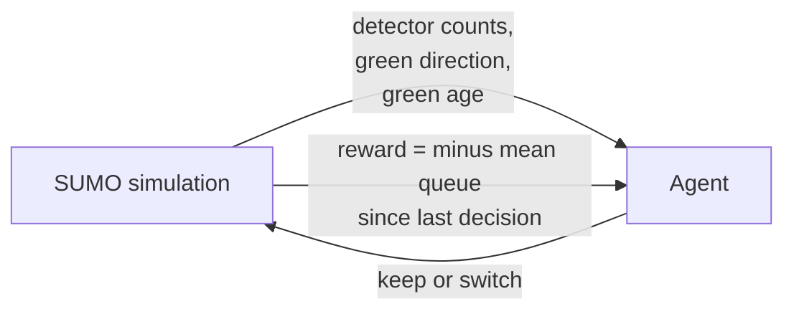
```mermaid
flowchart LR
    S[SUMO simulation] -->|detector counts,<br/>green direction,<br/>green age| AG[Agent]
    AG -->|keep or switch| S
    S -->|reward = minus mean queue<br/>since last decision| AG
```

---

## 3. Repository structure

```
smart-traffic-light-rl/
├── traffic_rl/                 the library: one idea per file
│   ├── scenarios.py            the 5 scenarios: files, arms, detectors, action mode
│   ├── env.py                  SUMO environment: min/max green, yellow, async decisions, metrics
│   ├── runner.py               one episode loop shared by training and evaluation
│   ├── baselines.py            fixed-time, Webster, actuated, random, longest queue first + queue reward
│   ├── state.py                detector counts -> table state / DQN input (uses SEMMA config)
│   ├── q_learning.py           tabular Q-learning (independent learners on the corridor)
│   ├── dqn.py                  NumPy DQN: MLP + Adam, replay buffer, target net, Double DQN
│   ├── multi_agent.py          coordinated Q-learning: neighbor state + shared reward
│   └── metrics.py              bootstrap CIs, paired differences, two-level bootstrap over runs
├── experiments/
│   ├── semma.py                data study: sample, explore, modify
│   ├── webster.py              measures saturation flow in SUMO, times a Webster fixed-time plan
│   ├── train.py                train any agent on any scenario (one training run)
│   ├── train_all.py            every learner x 5 runs, in parallel
│   ├── evaluate.py             held-out evaluation, probes, rubric -> results/RESULTS.md
│   └── make_figures.py         every figure in this README
├── networks/
│   ├── build_networks.py       builds four_way/ and lusaka/ (left-hand traffic, phases, detectors, demand)
│   ├── single/                 1 signal, 3-lane EB and SB approaches, 6 detectors
│   ├── corridor/               2 signals 285 m apart, normal and heavy demand
│   ├── four_way/               4 two-way arms, one lane each way, split phasing
│   ├── lusaka/                 Great East Rd / Lufubu Rd from OpenStreetMap, 3 demand levels
│   └── */webster.add.xml       the Webster fixed-time plan of each network
├── results/
│   ├── semma/                  sampled data, exploration figures, state_config.json
│   ├── logs/                   training and validation curves (CSV), one per run
│   ├── models/                 trained agents, 5 runs each (Q-tables as JSON, DQN weights as NPZ)
│   ├── figures/                result figures and sumo-gui screenshots
│   ├── webster.json            measured saturation flows, lost times and the Webster plans
│   ├── evaluation.csv          every controller x run x held-out seed
│   └── RESULTS.md              all tables and the rubric
├── docs/
│   ├── SEMMA.md                the data study write-up
│   └── CONCEPTS.md             a short course on every concept used here
└── tests/
    ├── test_agents.py          unit tests (Q update, gradient check, replay, LQF, Webster, statistics)
    └── test_env.py             SUMO tests (min/max green, yellow, warm-up, Webster plan, left-hand driving)
```

---

## 4. Input: the simulated world

<table>
<tr>
<td>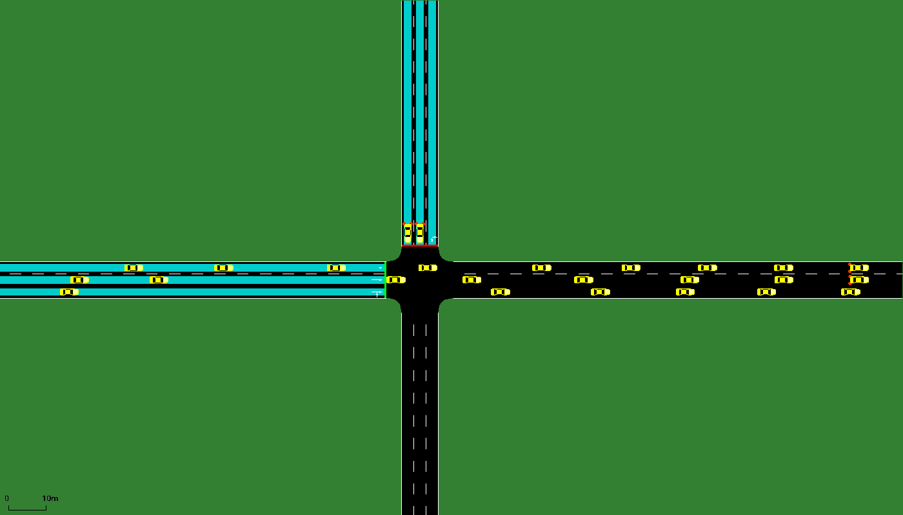</td>
<td>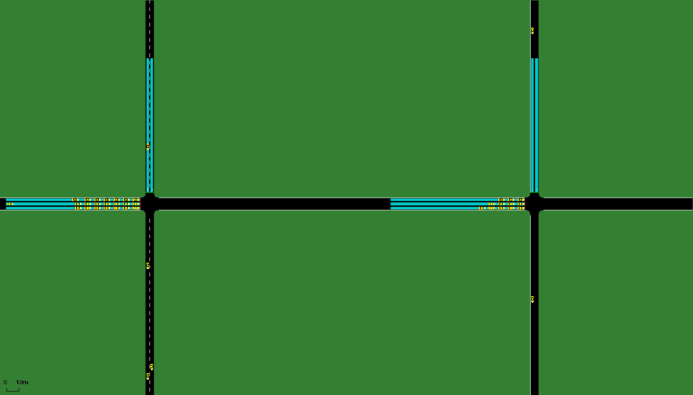</td>
</tr>
<tr>
<td align="center"><b>Single intersection</b> at t = 250 s. Cyan strips are the<br/>lane-area detectors, the agent's "cameras".</td>
<td align="center"><b>Corridor, heavy demand</b> at t = 400 s. Eastbound<br/>platoons leave Node2 and arrive at Node5.</td>
</tr>
</table>

| Scenario | Network | Demand (random arrivals) | Episode |
|---|---|---|---|
| `single` | 1 signal, 3 lanes per approach | EB 1500 / SB 500 veh/h, then 1000 / 1000, then 500 / 1500 | 300 s warm-up + 1200 s |
| `corridor` | 2 signals, EB 3 lanes, SB 2 lanes | EB 900, SB 400 at each junction (veh/h) | 300 s warm-up + 1200 s |
| `corridor_heavy` | same | EB 1400, SB 550 at each junction (veh/h) | 300 s warm-up + 1200 s |

Arrivals are random (a probability of a new car every second), so each seed
is different traffic. Every episode starts with empty roads, so the first
300 s are a **warm-up**: the controllers run as usual, but no metric counts
them. The seed ranges never overlap: 0 to 899 for training, 900 to 902 for the
SEMMA sample, 1000 to 1009 for the final test and 2000 to 2009 for validation.

**The decision problem (a Markov Decision Process):**

| | Definition |
|---|---|
| State (Q-learning) | EB count bin, SB count bin, which road has green, green age bin. Coordinated agents add the neighbor's green and count bin. |
| State (DQN) | 6 lane counts / 8, green one-hot, green age / 60 (9 numbers) |
| Action | 0 keep green for 5 more seconds, 1 switch (3 s yellow, then at least 10 s green) |
| Reward | minus the mean number of stopped vehicles at the detectors since the last decision. Coordinated agents also subtract 0.5 x the neighbor's queue. |
| Constraints | minimum green 10 s, maximum green 60 s, yellow 3 s. The same rules a real controller follows. |

---

## 5. Data study (SEMMA)

Before training we studied the detector data with the **SEMMA** process
(Sample, Explore, Modify, Model, Assess). Full write-up: [docs/SEMMA.md](docs/SEMMA.md).

- **Sample:** 67,500 per-second detector readings from fixed-time, actuated and random control on all three scenarios.
- **Explore:** counts are right-skewed, demand shifts as designed, and lanes within an approach are strongly correlated (0.79).
- **Found a data bug:** the detectors ended 10 to 16 m before the stop line, so on the corridor they saw only **37%** of the real queue. After moving them to the stop line, the same run showed **108%** (slightly over 100% because detectors count cars under 1.39 m/s as stopped). This was fixed before any training.
- **Modify:** the Q-learning bin edges (2, 4, 7, 11 vehicles) are the 25th, 50th, 75th and 90th percentiles of the data. The DQN input and reward scales are the 99th percentiles.

<table>
<tr>
<td>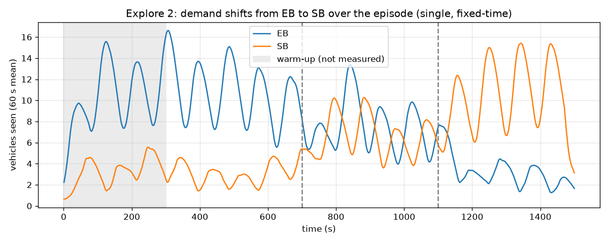</td>
<td>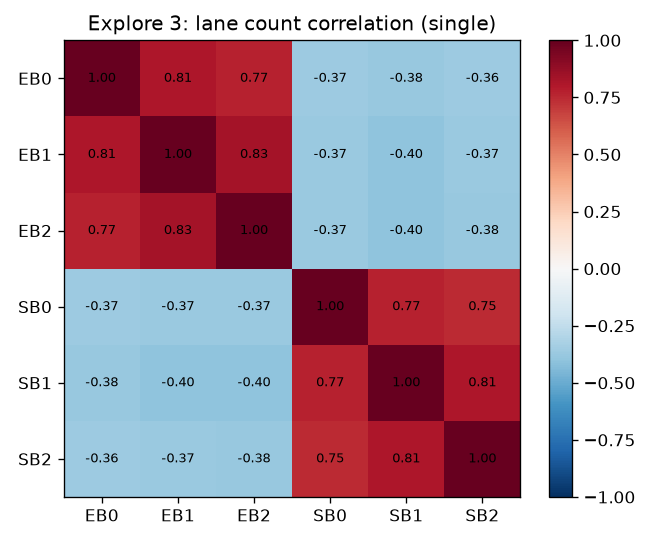</td>
</tr>
</table>

---

## 6. Methods

**Tabular Q-learning** (Watkins and Dayan, 1992). A table of values Q(s, a),
updated after every decision:

```
Q(s,a) <- Q(s,a) + alpha * [ r + gamma * max_a' Q(s',a') - Q(s,a) ]      alpha = 0.1, gamma = 0.9
```

**Deep Q-Network** (Mnih et al., 2015). A neural network (9 -> 32 -> 32 -> 2,
ReLU) replaces the table, so the agent can use all six lane counts and
generalize between similar states. It uses experience replay (buffer of 20,000,
batches of 64), a target network synced every 250 updates, the Double DQN target
(van Hasselt et al., 2016) and Huber loss. Written in plain NumPy, including
backpropagation and Adam, with a unit test that checks the gradients against
finite differences.

**Multi-agent Q-learning.** One Q-learning agent per intersection.
- *Independent* (Tan, 1993): each agent sees only its own detectors.
- *Coordinated*: neighbors share which road has green and how busy they are
  (one-hop message passing), and each agent's reward includes half of its
  neighbor's queue, so it "feels" the congestion it sends downstream. This is
  the cooperative reward shaping used in networked traffic control (Chu et
  al., 2019).

**Training.** Every agent, on every scenario, gets the same budget: 900
episodes of 25 simulated minutes each (5 of warm-up), so all learning curves
and comparisons are like for like. Epsilon-greedy exploration decays from 1.0
to 0.05 over the first 60% of episodes (540). Every 10 episodes the greedy
policy is scored on 10 validation seeds, and the best checkpoint is kept.

**Five training runs per learner.** One training run can be lucky or unlucky
(Henderson et al., 2018), so every learner is trained 5 times from scratch.
The run number seeds the initial weights, the exploration and the order in
which the 900 training traffic draws are met. All 5 trained models are
evaluated, and the tables report their mean.

**A fair fixed-time baseline.** The hand-set fixed-time plans (42 s per road,
30 s per arm, 40/10/20 s) were never optimized, so beating them says little.
`experiments/webster.py` therefore builds the plan a traffic engineer would:
it measures, in SUMO, how fast each green discharges a queue (saturation flow,
from the headways of the 5th queued car on, the Highway Capacity Manual's
field method) and how much of each phase is lost (start-up and unused yellow),
then times the cycle with Webster's (1958) formula from the average demand.
Both fixed-time plans are reported; the rubric uses Webster's.

**Evaluation protocol.** Every controller runs on the same 10 held-out seeds.
Because the traffic is identical for every controller, we compare them seed by
seed (paired differences) and report 95% percentile bootstrap confidence
intervals (Efron and Tibshirani, 1993). For a learner the bootstrap works at
two levels: each resample draws 5 training runs, then 10 traffic seeds, so the
interval covers both "which traffic" and "which training run". "Before
training" means the same agent with its initial parameters, so before vs after
isolates what learning added. The agents are trained on queue length, and we
also report waiting time and travel time, which they never optimized directly.
Every metric leaves out the 300 s warm-up.

---

## 7. Output and performance

### Before vs after training

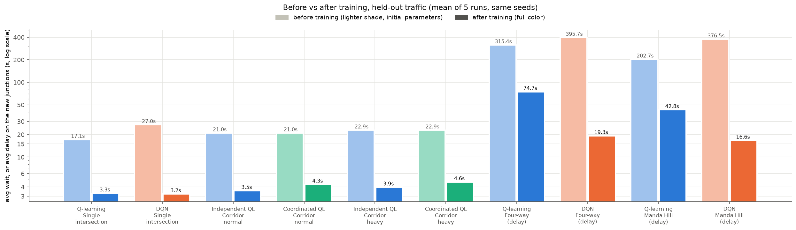

| Scenario | Learner | Wait before | Wait after | Change |
|---|---|---|---|---|
| Single | Q-learning | 17.1 s | 3.3 s | **-81%** |
| Single | DQN | 27.0 s | 3.2 s | **-88%** |
| Corridor | Independent QL | 21.0 s | 3.5 s | **-83%** |
| Corridor | Coordinated QL | 21.0 s | 4.3 s | **-79%** |
| Corridor heavy | Independent QL | 22.9 s | 3.9 s | **-83%** |
| Corridor heavy | Coordinated QL | 22.9 s | 4.6 s | **-80%** |

*Mean over the 5 runs, each before and after its own training.*

An untrained Q-table has all values at zero, so it always keeps the green
until the 60 s maximum forces a switch. That is a slow fixed cycle, worse than
even the hand-set 42 s plan, and it is the same for every run. An untrained DQN
starts from random weights, so it depends on the run: three of the five
initial networks happen to switch often and already score 3.8 s, the other two
score 28 s and 95 s. Training brings all five to 3.2 s. Five runs show both
sides; a single run would have shown only one.

### Learning curves

Each curve is the greedy policy scored on the 10 validation seeds every 10
episodes, all on the same 0 to 900 episode axis: the line is the mean of the 5
runs and the band goes from the best to the worst run. The dashed lines are the
baselines' scores on the held-out test seeds.

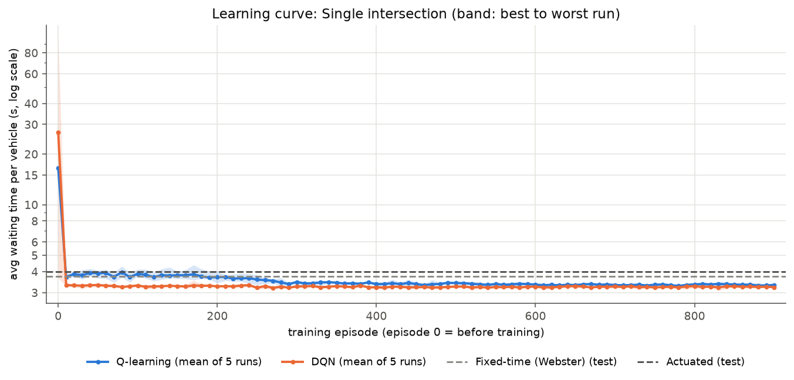

On the single intersection the DQN gets below both actuated control and the
Webster plan within 10 episodes. Q-learning hovers around them for about 250
episodes, then settles below. All 5 runs of each learner stay close together.
The DQN is the smoother learner: the network generalizes, so one bad episode
does not flip whole regions of the policy the way it can in a table.

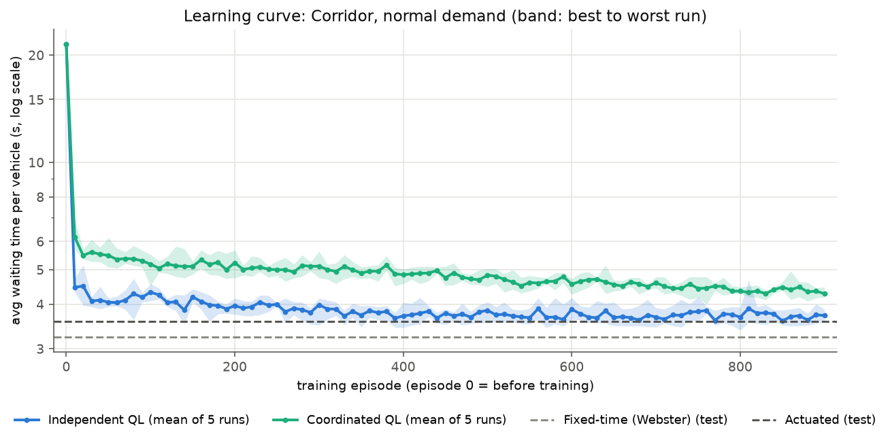

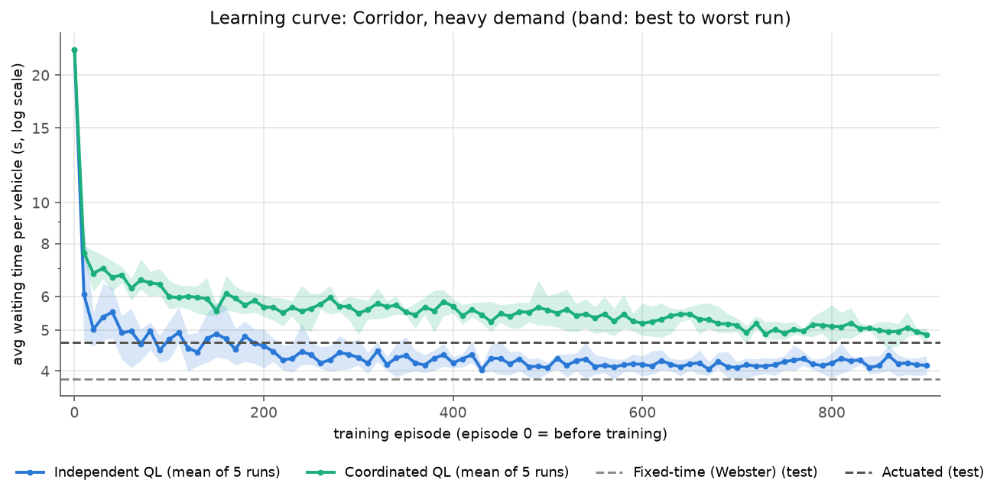

On both corridors the independent learners settle near actuated control
within about 300 episodes, but never reach the Webster line. The coordinated
learners stay above them the whole way; they keep closing the gap until
episode 900, but do not catch up.

### Head to head (held-out traffic)

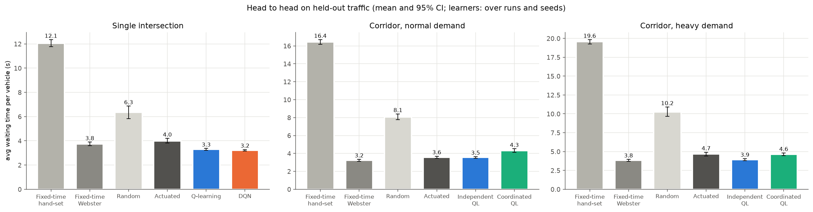

| Controller | Single | Corridor | Corridor heavy |
|---|---|---|---|
| Fixed-time, hand-set | 12.1 s | 16.4 s | 19.6 s |
| Fixed-time, Webster | 3.8 s | **3.2 s** | **3.8 s** |
| Random switching | 6.3 s | 8.1 s | 10.2 s |
| Actuated (SUMO) | 4.0 s | 3.6 s | 4.7 s |
| Q-learning / Independent QL | 3.3 s | 3.5 s | **3.9 s** |
| DQN | **3.2 s** | | |
| Coordinated QL | | 4.3 s | 4.6 s |

*Average waiting time per vehicle, mean over 5 runs and 10 seeds; bold = best,
or tied with the best. Paired confidence intervals for every learner against
Webster, actuated control and longest queue first are in
[results/RESULTS.md](results/RESULTS.md#trained-learners-vs-webster-fixed-time).
Every learner serves the full demand (100.2% to 100.8% of Webster's throughput).*

**A properly timed fixed plan is hard to beat on steady traffic.** Replacing
the hand-set plans with Webster's changes the v1 story. On the single
intersection, where demand shifts three times, both learners still beat
Webster (DQN -0.54 s, CI -0.70 to -0.39). On the corridor the demand is steady
for the whole hour, which is exactly what Webster's method assumes, and its
short cycle (26 to 28 s) serves it well: independent QL is 0.32 s worse (CI +0.17 to
+0.47) and under heavy demand the two tie (+0.11 s, CI -0.03 to +0.25), while
independent QL still beats actuated control there (-0.73 s, CI -0.99 to -0.42).
The short fixed cycle also caps how long any single car can wait: every learner
has a longer worst-case wait than Webster on the v1 networks (by 16 to 30 s).

**DQN vs Q-learning.** On the single intersection the DQN is slightly better
(3.2 vs 3.3 s) and much more robust. The Q-value probes below show why: every
one of the 5 DQNs answers all 4 hand-made traffic situations correctly. The
Q-tables get the two "switch" cases right, but none of them visited the two
"keep" states during training, so they have no answer for them (the one run that did visit one of them
chose the wrong action there). A table cannot generalize
to states it has not seen. This is the "huge knowledge space" argument for deep
RL made concrete.

| Probe state | Right answer | Q-learning (5 runs) | DQN (5 runs) |
|---|---|---|---|
| SB busy, EB empty, EB has green | switch | switch in 5 of 5 | switch in 5 of 5 |
| EB busy, SB empty, SB has green | switch | switch in 5 of 5 | switch in 5 of 5 |
| EB busy, SB empty, EB has green | keep | never visited in 5 of 5 | keep in 5 of 5 |
| SB busy, EB empty, SB has green | keep | never visited in 4, "switch" in 1 | keep in 5 of 5 |

**Independent vs coordinated.** This is the research question from the
write-up, and the honest answer here is **no, coordination did not help**.
Coordinated agents were 0.8 s (normal) and 0.7 s (heavy) slower than
independent ones (95% CI over runs and seeds: +0.6 to +1.0 s and +0.5 to
+0.9 s). Under heavy demand they did at least match actuated control
(-0.03 s, CI -0.32 to +0.27, a tie). All 5 coordinated runs agree (4.1 to 4.5 s
on the normal corridor), so this is not one unlucky run. The likely reasons:

- *State explosion.* The neighbor information multiplies the table size by
  about 10 (about 2,360 to 2,550 states vs 195 to 236, see the growth curve
  below). Each state is visited far less often, so its value estimate stays noisier.
- *The neighbor signal is weak here.* The two signals are 285 m apart and
  platoons disperse on the way, so the neighbor's current phase says little
  about arrivals in the next 5 seconds.
- *Shared reward adds noise.* Half of the neighbor's queue enters the reward,
  but the agent has only partial control over it.

This agrees with the literature: coordination pays off in dense grids and
near saturation, and it needs function approximation (e.g. a DQN per agent)
to cope with the larger state. That is the natural next step (section 11).

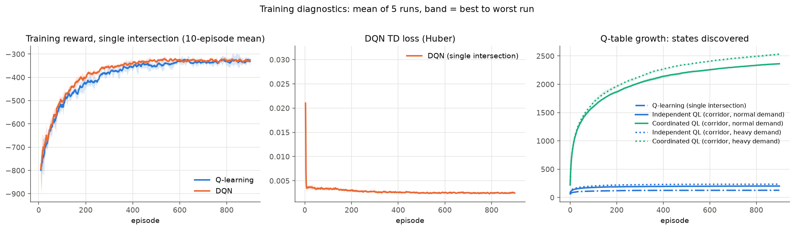

---

## 8. Part 2: a real junction, four arms and a Lusaka case study

The v1 networks were simplified: one-way approaches and only two arms. Part 2
asks the same questions on roads that look like real ones.

### 8.1 Why Lusaka, and why this junction

In April 2021 Lusaka City Council switched off the traffic lights at the
junction of **Great East Road and Lufubu Road**, next to East Park Mall,
because they were building up queues at peak hours (Lusaka Times, 2021). The
Council also noted that new signals in the city were often poorly
synchronised. The right turn into the mall was closed at the same time. So this is a real
place where signal control failed, which makes a fair question: *could an
adaptive signal have kept this junction working?*

Zambia drives on the **left**, so every Part 2 network is built with
`netconvert --lefthand`. Cars keep left, and the right turn is the movement
that crosses oncoming traffic. A test checks every arm of both networks.

### 8.2 The two new networks

<table>
<tr>
<td>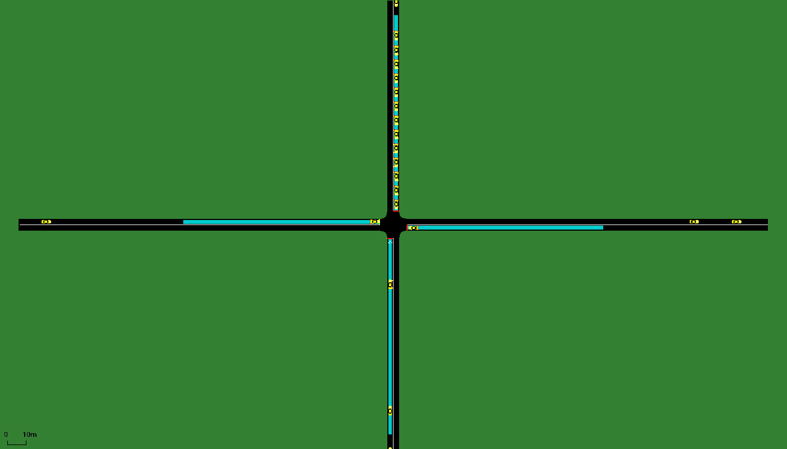</td>
<td>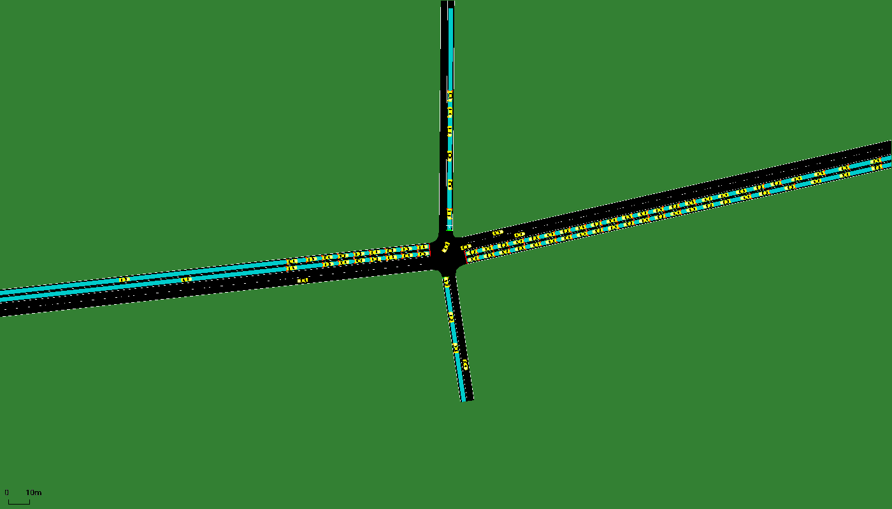</td>
</tr>
<tr>
<td align="center"><b>Four-way junction</b>: every road two-way with one lane each<br/>direction. The north arm queues under fixed-time control.</td>
<td align="center"><b>Great East Rd / Lufubu Rd, Lusaka</b>: dual carriageway<br/>(2 lanes each way) with Lufubu Road (north) and the mall access (south).</td>
</tr>
</table>

| | Four-way junction | Lusaka junction |
|---|---|---|
| Geometry | 4 arms of 200 m, one lane in and one lane out each | Rebuilt from an OpenStreetMap extract: arm bearings, lane counts and speed limits (60 to 80 km/h) from OSM tags; the two carriageways joined as the crossroads it was before 2021 |
| Signal program | Split phasing: one arm green at a time (common in Zambia) | 3 greens: main road both ways (right turns give way), protected main-road right turns, side roads |
| Agent's action | Which arm to serve next (4 actions) | Which of the 3 greens to show next |
| Fixed-time plans | hand-set 30 s per arm; Webster 15 / 15 / 13 / 13 s (N, E, S, W) | hand-set 40 / 10 / 20 s; Webster 37 / 10 / 20 s (3 s yellow after each green) |
| Demand | 60% straight, 20% left, 20% right; N-S heavy, then balanced, then E-W heavy | Morning peak, see the sources below |
| Built by | `networks/build_networks.py four_way` | `networks/build_networks.py lusaka` |

**Where the Lusaka demand comes from.** No public turning counts exist for this junction. The demand is built from one old published daily volume and assumed planning factors, and then tested at ±25%. Each row says whether it is measured, reported or assumed:

| Quantity | Value | Status | Source |
|---|---|---|---|
| Geometry, lanes, speed limits | as mapped | Measured | OpenStreetMap extract, committed in `networks/lusaka/` |
| Great East Road daily traffic | about 31,000 veh/day, **in 2009** | Reported | Choongo (2020), UNZA; counting place and method not stated |
| Peak-hour share K | 0.09 | Assumed | A common planning value, not measured in Lusaka |
| Direction split D | 0.6 towards the city (westbound) | Assumed | The value is assumed; the direction follows the westbound morning peak quoted by Ng'andu (2024) |
| Great East Road peak volumes | 1,674 veh/h westbound, 1,116 eastbound | Derived | 31,000 × K × D |
| Lufubu Road and mall access | 300 and 200 veh/h | Assumed | No source |
| Turning shares | Main road 85% straight, 8% left, 7% right; side roads mostly turning | Assumed | No source |
| Fixed-time plan before 2021 | 40 s / 10 s / 20 s | Assumed | No source |
| Sensitivity | every controller re-tested at ×0.75 and ×1.25 | | Section 8.5 |

**A check against a recent count.** Ng'andu (2024) counted 1,545 veh/h on Great East Road from video on a weekday between 07:00 and 08:00 in 2022, near Bwinjimfumu bus stop, not at this junction. The study does not say whether the count covers one direction or both. If it is one direction, our westbound 1,674 veh/h is 8% higher. If it is both, our two-way 2,790 veh/h is 80% higher, and even the ×0.75 sweep (2,093 veh/h) stays above it. The same study quotes Lusaka City Council peak periods of 07:30 to 08:30 westbound and 15:30 to 18:30 eastbound. The Lusaka results therefore compare controllers on the real geometry under a plausible but possibly high peak. They are not predictions of real delays at this junction.

### 8.3 Data study (SEMMA) on the new junctions

The same SEMMA steps were applied to 27,000 new per-second samples. The full
write-up, with all figures, is in [docs/SEMMA.md](docs/SEMMA.md#part-2-the-four-way-and-lusaka-junctions).

- **The main-road detectors saturated.** With 105 m detectors, the Great East
  Road counts hit their ceiling (28 = 2 lanes × 14 cars) and saw only 71% of
  the queue, so the agent could not tell 28 queued cars from 60. The main road
  was re-equipped with 250 m detectors, like the advance detectors used on
  major roads. Coverage went from 71% to 123% (both regenerated by
  `experiments/semma.py`).
- **One arm dominates at Lusaka.** Under fixed-time and actuated control, the
  westbound peak arm holds about 30 stopped cars on average, against 1 to 10 on
  the others. At the end of an episode the baselines leave 107 (actuated) to
  167 (Webster fixed-time) cars queued outside the modelled road.

<table>
<tr>
<td>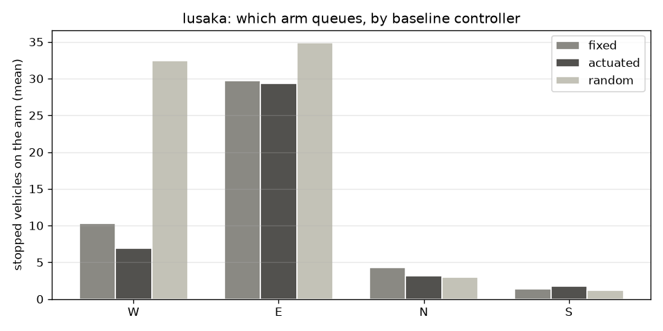</td>
<td>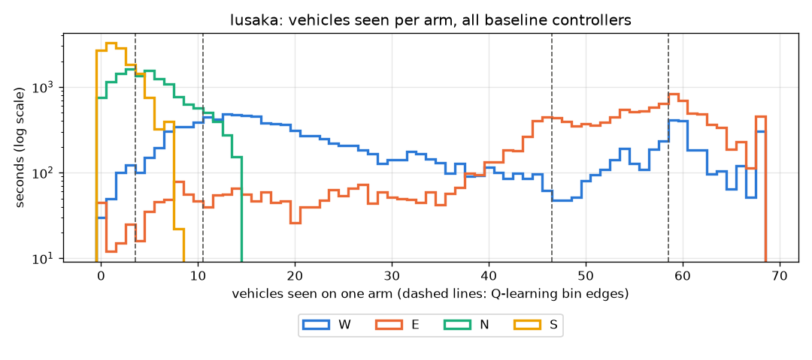</td>
</tr>
</table>

- **Bins from the data.** The westbound arm is either draining or backed up
  far down the road, and the Q-learning bin edges (4, 11, 47, 59) fall between
  those regimes. Each junction gets its own bins and scales in `state_config.json`.
- **Lanes of one arm move together** (correlation 0.82 within an arm, 0.11
  across arms), so the Q-learning state keeps one count per arm, as in v1.

### 8.4 A new metric: delay, not just wait

At Lusaka the queue can grow past the 300 m of modelled road, and those cars
never "enter". A controller that starves an arm could therefore *lower* the
average wait, simply by keeping cars out. So the Part 2 junctions are judged on
**average delay**: time stopped plus time queued before entering, for every
car, including those still outside at the end. Checkpoint selection during
training uses the same metric. When it was added (v1.1), a regression check
reproduced every v1 result exactly before any agent was retrained.

### 8.5 Results

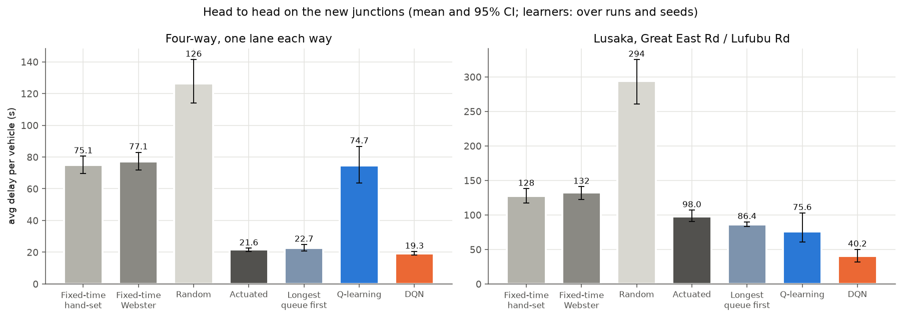

| Controller | Four-way delay | Four-way worst delay | Lusaka delay | Lusaka worst delay | Lusaka cars through |
|---|---|---|---|---|---|
| Fixed-time, hand-set | 75.1 s | 262 s | 127.7 s | 533 s | 914 |
| Fixed-time, Webster | 77.1 s | 249 s | 132.5 s | 534 s | 925 |
| Random | 126.2 s | 461 s | 294.1 s | 706 s | 679 |
| Actuated | 21.6 s | **78 s** | 98.0 s | 491 s | 969 |
| Longest queue first | 22.7 s | 157 s | 86.4 s | 1,020 s | 981 |
| Q-learning | 74.7 s | 304 s | 75.6 s | 319 s | 975 |
| **DQN** | **19.3 s** | 141 s | **40.2 s** | **199 s** | **1,024** |

*Mean over 10 held-out seeds (learners: and over 5 training runs). "Cars through" = vehicles that completed their trip in the 20 measured minutes.*

**Before vs after training** (average delay, same seeds): Q-learning 315.4 → 74.7 s (four-way) and 96.9 → 75.6 s (Lusaka); DQN 395.7 → 19.3 s and 458.7 → 40.2 s. Every change has a 95% CI below zero except Q-learning at Lusaka (-21.3 s, CI -37.4 to +5.8): one of its five runs ended at 112 s, worse than the untrained table, which already cycles the greens at the 60 s maximum.

**What the numbers say:**

- **The DQN is the best controller on both junctions.** It beats Webster,
  actuated control and longest-queue-first at both, with CIs over runs and
  seeds that exclude zero. At Lusaka it cuts average delay by 59% against
  actuated control (-57.7 s, CI -69.8 to -44.3), gets 6% more cars through
  (1,024 vs 969), and leaves the fewest queued outside (42 vs 107). On the
  four-way the margin over actuated control is small but consistent
  (-2.3 s, CI -3.2 to -1.4, or 11%).
- **Every one of the five DQN runs wins.** The runs score 19.0 to 19.9 s on the
  four-way and 37.8 to 44.0 s at Lusaka, all below actuated control (21.6 s and
  98.0 s). The DQN also answers every logic probe in all 5 runs on the single
  intersection and the four-way, and in 3 of 5 runs at Lusaka; the other two
  keep the main road green when the side roads are busy.
- **Fixed plans cannot fix these junctions.** Webster's plan is no better than
  the hand-set one on either junction (77.1 vs 75.1 s, and 132.5 vs 127.7 s).
  At Lusaka it is almost the same plan (37/10/20 s against 40/10/20 s). On the
  four-way, demand moves from the north-south roads to the east-west roads, and
  one plan timed for the average leaves north-arm cars with 137 s of delay on average.
- **Tabular Q-learning breaks down on four arms.** With a bin per arm, the
  table grows to about 3,270 states in every run, and 900 episodes cannot fill
  it. It ties with Webster fixed-time on the four-way (-2.3 s, CI -13.0 to
  +8.6) and is 53 s worse than actuated control. No run answers all four probe
  states, mostly because it never visited them. This is the "huge knowledge
  space" argument for deep Q-networks made concrete. At Lusaka, where the table
  stays at about 610 states, it beats Webster clearly (-56.8 s) and ties with
  actuated control (-22.4 s, CI -38.3 to +1.7), but its runs disagree
  (64 to 112 s).
- **Fairness is where the story gets interesting.** The average hides the
  unlucky driver:

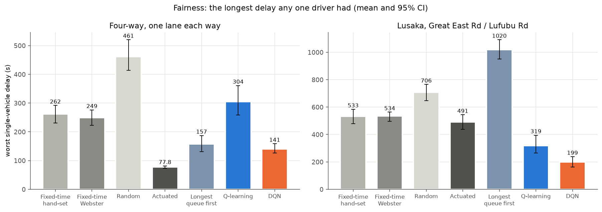

  - **Longest-queue-first starves the side roads.** It serves the busy main road
    almost all the time. Lufubu Road cars are delayed 541 s on average and mall
    traffic 491 s, and the worst single delay is 1,020 s, about 17 minutes. A
    policy that looks fine on the average can be unacceptable to a whole
    neighbourhood.
  - **At Lusaka, the DQN is also the fairest controller** (worst delay 199 s vs 491 s for actuated).
  - **On the four-way, the DQN fails the fairness check.** Its per-arm averages
    are balanced (18 to 21 s), but its worst single delay (141 s) is 1.8 times
    actuated control's (78 s). Actuated control cycles regularly, which keeps
    the tail short. We report this as a trade-off, not a win.

**Demand sweep.** Because the Lusaka volumes are estimates, every controller was re-run at 75% and 125% of them:

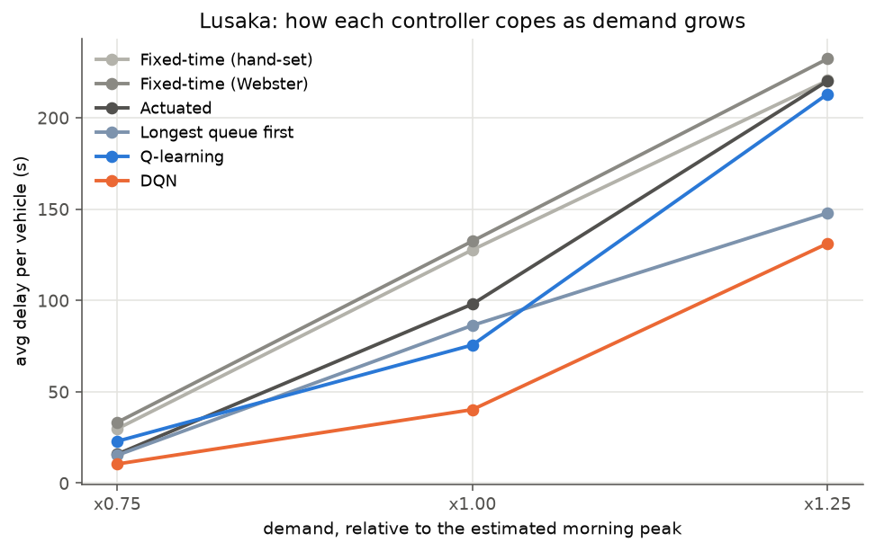

The DQN stays the best at every level: 10.5 s, 40.2 s and 131.2 s of average
delay, against 15.9 s, 98.0 s and 220.2 s for actuated control. At 125% the
junction is simply over capacity, and every controller leaves a large queue
outside; longest-queue-first comes second there (147.8 s) but its worst single
delay is 1,193 s. The fixed plans are the weakest, or tied weakest, at every level. So the ranking holds
even though the exact volumes are uncertain.

**Learning curves on the new junctions** (average delay on the validation seeds):

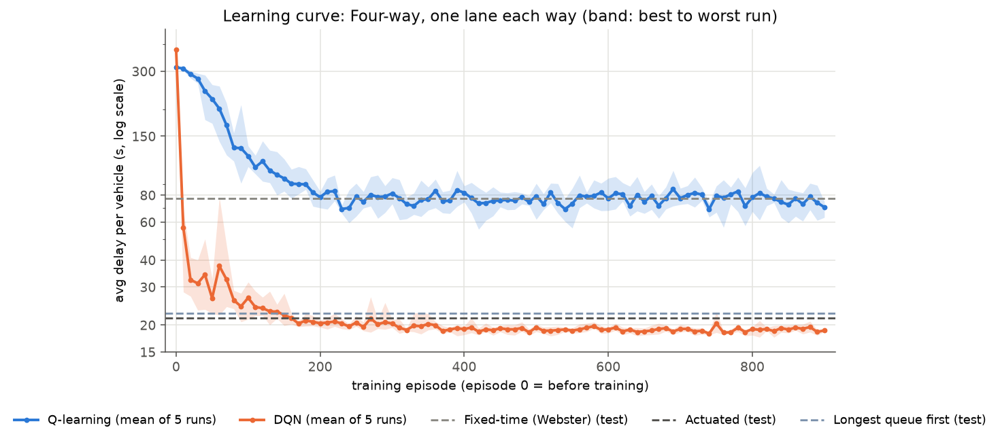

On the four-way the DQN drops below actuated control within about 170
episodes and keeps creeping down to about 18.5 s by episode 900, with all 5
runs close together. Tabular Q-learning improves quickly for about 200
episodes, then hovers around the Webster line for the rest of training: its
table is too big to fill.

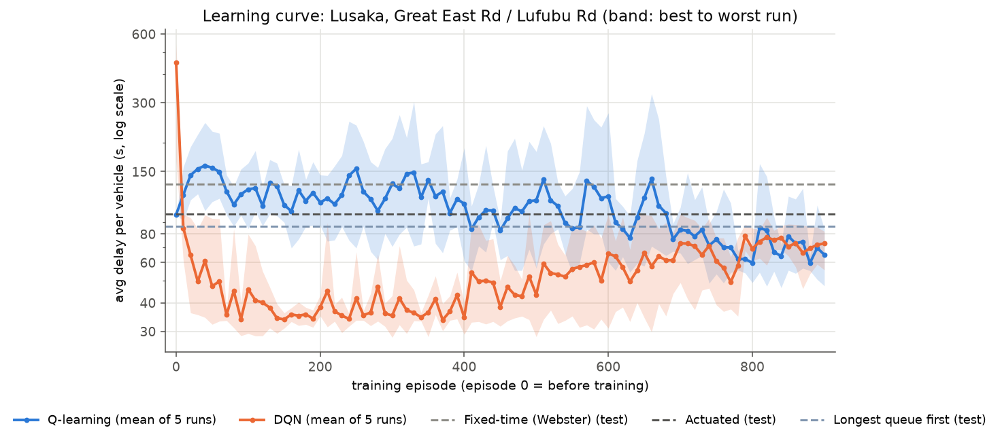

At Lusaka the DQN is at its best between about episodes 100 and 400 (about
35 s on the validation seeds), then drifts upward to about 70 s by episode 900,
and the band shows the drift in every run. Keeping the best checkpoint on
separate validation traffic protects the final models from it: their test
score is 40.2 s. The chosen checkpoints scored 29.8 s on the 10 validation
seeds, so picking the best of 90 checkpoints still flatters them a little
(with 3 seeds in v1.2 the gap was 17.9 vs 32.3 s). Why the DQN drifts was not
tested; a likely cause is that, as exploration fades, the replay buffer fills
with near-greedy experience and the network forgets how to handle the states
it no longer visits. Tabular Q-learning is noisy throughout and improves late.

---

## 9. Rubric

Scored automatically by `experiments/evaluate.py`. **58 of 76 checks pass.** v1
scenarios are judged on average wait, Part 2 junctions on average delay. Every
CI covers both the 5 training runs and the 10 traffic seeds. (v1.2.1 passed 63,
against the hand-set fixed-time plans and with one training run per learner;
the stricter baseline accounts for the difference.)

| Criterion | Measure | Threshold | Result |
|---|---|---|---|
| Every learner learned (10 checks) | trained minus untrained, paired 95% CI | CI below 0 | 9 of 10 (Q-learning at Lusaka: one bad run, CI -37.4 to +5.8) |
| Beats Webster fixed-time (10) | paired 95% CI | CI below 0 | 5 of 10 (all four corridor checks, and Q-learning on the four-way) |
| Beats random switching (10) | paired 95% CI | CI below 0 | **10 of 10 PASS** |
| Competitive with actuated control (10) | vs actuated, paired 95% CI | within +10% | 8 of 10 (coordinated corridor +21%, Q-learning four-way +247%) |
| Beats longest queue first (4, Part 2) | paired 95% CI | CI below 0 | 2 of 4 (Q-learning on both junctions) |
| Starves no one (4, Part 2) | worst single delay vs actuated | at most 1.25 x | 2 of 4 (both learners on the four-way) |
| Learned traffic logic (6) | runs answering every hand-made probe | at least 3 of 5 runs | 3 of 6 (every DQN passes; no Q-table does) |
| Stable learning (10) | TD loss, last 20 vs first 20 episodes | in at least 3 of 5 runs | **10 of 10 PASS** (5 of 5 runs each) |
| Coordination helps (2) | coordinated minus independent wait, 95% CI | CI below 0 | 0 of 2 (+0.8 s, +0.7 s) |
| Serves all demand (10) | vehicles completed vs Webster fixed-time | at least 98% | 9 of 10 (Q-learning on the four-way: 95.6%) |

Every row with the per-check numbers is in [results/RESULTS.md](results/RESULTS.md#rubric).

---

## 10. What did not work, and what we learned

These dead ends are part of the result:

1. **Deciding every 0.1 s.** The first DQN (adapted from the tutorial) chose
   keep or switch at every 0.1 s step with a per-sample online update. At that
   time scale one action barely changes anything, so Q(keep) and Q(switch) were
   equal up to noise. The trained policy was *worse than an untrained network*
   on held-out traffic. Adding replay and a target network alone did not fix it.
   The fix was the decision model: decide only when a switch is allowed, then
   every 5 s. That is the standard in traffic signal RL.
2. **Detectors that missed the queue.** Found by the SEMMA data study (section 5).
3. **Greedy lock-in in the Q-table.** Early trained Q-tables sometimes kept one
   green for the whole 20 minutes on a test seed (197 s average wait). In a
   rarely visited state, both Q-values were still near their zero start, "keep"
   led back into the same state, and a greedy agent never escaped. Exploration
   had hidden this during training. The fix was a 60 s maximum green, a rule
   every real controller has and the actuated baseline already used.
4. **Port clashes in parallel runs.** Several runs connecting to SUMO over
   TraCI sockets occasionally picked the same port and crashed. Switching to
   `libsumo` (SUMO inside the Python process) removed the ports and made
   episodes 7.6x faster, with identical results.
5. **A metric that could reward starvation.** Average wait only counts cars
   that entered the modelled road. At Lusaka a controller could push its queue
   outside and look better. Found while checking a result that seemed too good.
   The fix was total delay, for evaluation and for checkpoint selection
   (section 8.4). The good result survived the stricter metric.
6. **Detectors too short for a dual carriageway.** 105 m was enough for the v1
   junctions but saturated on Great East Road. Found by SEMMA (section 8.3).
7. **Split phasing does not suit a busy dual carriageway.** Serving one arm at a
   time would oversaturate Great East Road at about 1,700 veh/h. The Lusaka
   junction uses the realistic main road / right turns / side roads program
   instead.
8. **A weak baseline.** Up to v1.2.1 the fixed-time baseline was a hand-set plan
   that nobody had optimized, and every learner looked 70 to 80% better than
   fixed-time on the v1 networks. A plan timed with Webster's method from
   measured saturation flows is as good as actuated control there, and on the
   steady corridor it beats every learner. The comparison that matters is
   against the best simple method, not the easiest one.
9. **One training run is not a result.** Up to v1.2.1 each learner was trained
   once. The Lusaka DQN then scored 23.9 s or 32.3 s depending on the budget,
   and nothing showed whether that was training or luck. With 5 runs, Lusaka
   Q-learning spans 64 to 112 s while the DQN spans 38 to 44 s. Every learner
   is now trained 5 times and judged over all of them.
10. **Three validation seeds overfit.** Picking the best of 90 checkpoints on 3
   validation seeds chose Lusaka models that were lucky on those seeds (17.9 s
   on validation, 32.3 s on test). With 10 validation seeds the gap is smaller
   (29.8 vs 40.2 s), though still there.

---

## 11. Limitations and next steps

- **Lusaka demand is estimated**, not counted: a daily volume from 2009,
  assumed peak factors, and assumed side-road volumes and turning shares. It
  may be high compared with a 2022 count (section 8.2). The ×0.75 / ×1.25
  sweep shows the ranking holds, but real turning counts from the Council or a
  video survey are the most valuable next step.
- **Only the junction itself is modelled**: 300 m arms, with no neighbouring
  junctions, minibus stops, informal parking or pedestrians. Each affects real
  capacity on Great East Road.
- **Detector reach on the four-way.** The 105 m single-lane detectors sometimes
  fill up (14 cars) on the busy north arm, so the agent then sees only part of
  the queue. Coverage is still 89%, but longer detectors may help there too.
- **Simulated detectors.** Real cameras add noise, occlusion and delay; the
  agent should be trained with noisy counts before any field test.
- **The DQN's worst-case delay** on the four-way is 1.8 times actuated
  control's. A fairness term in the reward (e.g. penalising the longest wait)
  is the obvious next experiment.
- **The DQN drifts at Lusaka.** Its validation score worsens after about 400
  episodes in every run. Checkpoint selection protects the final models, but a
  stable learner would be better: fewer episodes, a learning rate that decays,
  or averaging recent checkpoints are the next things to try.
- **One fixed plan per scenario.** Webster's plan uses the average demand. A
  traffic engineer would add time-of-day plans where demand shifts (the single
  intersection and the four-way) and green-wave offsets on the corridor. Both
  would make the fixed-time baseline stronger still.
- **Untuned hyperparameters.** The learning rate, discount, network size and the
  0.5 neighbour weight were chosen once and never tuned or varied; a
  sensitivity study is future work.
- **Many comparisons.** The rubric makes 76 checks without a
  multiple-comparison correction, so a few borderline passes or fails may be
  chance.
- **Coordination used tabular agents.** Next: one DQN per intersection with the
  neighbor features as extra inputs, on a stretch of Great East Road with
  several signals.

---

## 12. Reproduce

Tested with Python 3.14.7 on Windows 11. SUMO installs through pip; no separate
install is needed, and `requirements.txt` pins the versions the results were
produced with.

```bash
python -m venv .venv
source .venv/Scripts/activate   # Windows Git Bash (Linux/macOS: source .venv/bin/activate)
pip install -r requirements.txt
```

```bash
python -m pytest tests                   # 27 tests; the SUMO ones skip if SUMO is missing
python experiments/semma.py              # data study: bins and scales (under a minute)
python experiments/webster.py            # saturation flows and Webster plans (about 1 min)
python experiments/train_all.py          # 10 learners x 5 runs x 900 episodes, in parallel
python experiments/evaluate.py           # results/RESULTS.md (about 5 min in parallel)
python experiments/make_figures.py       # results/figures/
```

The Part 2 networks are already in `networks/`. To rebuild them from the
node/edge definitions and the committed OpenStreetMap extract:

```bash
python networks/build_networks.py
```

One training run is a single call, e.g.
`python experiments/train.py --agent dqn --scenario lusaka --run 0`.
`train_all.py` runs all 50 in parallel (one process each; about 1 h 45 min on 14
of 16 CPU threads). Everything is seeded, so the numbers should match
`results/` exactly with the pinned versions.

---

## 13. References

- Watkins, C. and Dayan, P. (1992). Q-learning. *Machine Learning*, 8, 279-292.
- Tan, M. (1993). Multi-agent reinforcement learning: independent vs. cooperative agents. *ICML*.
- Efron, B. and Tibshirani, R. (1993). *An Introduction to the Bootstrap*. Chapman and Hall.
- Mnih, V. et al. (2015). Human-level control through deep reinforcement learning. *Nature*, 518, 529-533.
- van Hasselt, H., Guez, A. and Silver, D. (2016). Deep reinforcement learning with double Q-learning. *AAAI*.
- Lopez, P. A. et al. (2018). Microscopic traffic simulation using SUMO. *IEEE ITSC*.
- Wei, H., Zheng, G., Yao, H. and Li, Z. (2018). IntelliLight: a reinforcement learning approach for intelligent traffic light control. *KDD*.
- Chu, T., Wang, J., Codeca, L. and Li, Z. (2019). Multi-agent deep reinforcement learning for large-scale traffic signal control. *IEEE Transactions on Intelligent Transportation Systems*, 21(3).
- Wei, H., Zheng, G., Gayah, V. and Li, Z. (2019). A survey on traffic signal control methods. arXiv:1904.08117.
- Sutton, R. and Barto, A. (2018). *Reinforcement Learning: An Introduction*, 2nd ed. MIT Press.
- SAS Institute. SEMMA data mining methodology.
- Varaiya, P. (2013). Max pressure control of a network of signalized intersections. *Transportation Research Part C*, 36, 177-195.
- Webster, F. V. (1958). *Traffic Signal Settings*. Road Research Technical Paper 39, HMSO, London.
- Transportation Research Board (2022). *Highway Capacity Manual*, 7th ed., Chapter 31, Signalized Intersections: Supplemental (field measurement of saturation flow).
- Henderson, P. et al. (2018). Deep reinforcement learning that matters. *AAAI*.
- Lusaka Times (23 April 2021). LCC "switches off" robots at Great East and Lufubu roads.
- Choongo, B. (2020). *Quality of public transport service in the city of Lusaka: a case study of the minibus service on the Great East Road*. University of Zambia (quotes 31,000 veh/day on Great East Road in 2009).
- Ng'andu, L. (2024). *An assessment of the Lusaka Decongestion Project (LDP): a case study of Great East Road*. MSc dissertation, University of Zambia (2022 video count and LCC peak periods).
- OpenStreetMap contributors. Map data for the Lusaka junction, ODbL. https://www.openstreetmap.org/copyright

Built on the RoadwayVR SUMO tutorial (MIT); see [NOTICE.md](NOTICE.md). Map data © OpenStreetMap contributors (ODbL). Licensed under MIT.
