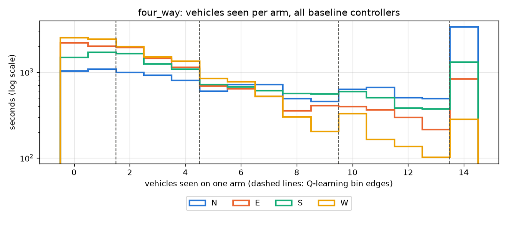
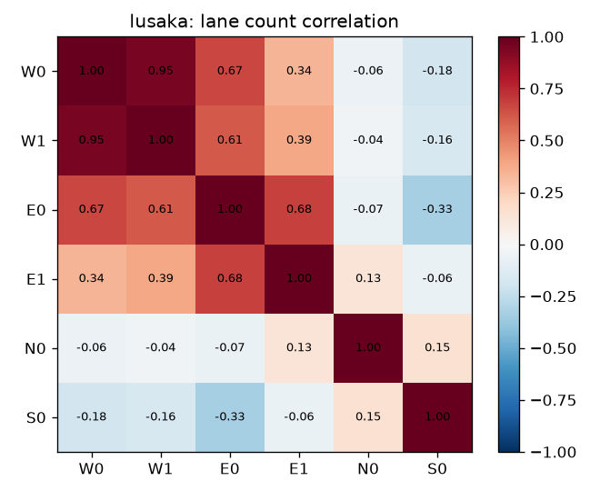

# Data study: SEMMA

Before training any agent we studied the data the agents would see. We used
**SEMMA** (Sample, Explore, Modify, Model, Assess), the data mining process
from SAS Institute. We chose SEMMA over CRISP-DM because the business
question is already fixed (reduce waiting at signals, see the README), and
SEMMA focuses on the technical data-to-model steps. For readers who know
CRISP-DM: Sample and Explore are "Data Understanding", Modify is
"Data Preparation", Model and Assess are "Modeling" and "Evaluation".

Code: [`experiments/semma.py`](../experiments/semma.py). Output: [`results/semma/`](../results/semma/).

## 1. Sample

The data is what the lane-area detectors (E2 detectors, the "cameras") report
every second: vehicles per lane, stopped vehicles, which approach has green.

- 3 scenarios (single intersection, corridor normal, corridor heavy)
- 3 controllers that need no training: fixed-time, actuated, random switching
- 3 seeds each (900-902, never used for training or evaluation)
- 1,500 s per run, one row per intersection per second: the 300 s warm-up and
  the 1,200 s measured window. The warm-up is sampled too, because the agents
  act during it and must handle the emptier roads it starts with.

That gives **67,500 rows**, saved as `detector_samples.csv.gz`. Using three
different controllers matters: an agent will visit states that fixed-time
never produces (for example very long or very short greens), so the sample
has to cover them.

## 2. Explore

| Finding | Evidence | Figure |
|---|---|---|
| Counts are right-skewed. Most seconds see a few cars, a long tail sees many. | Single: median 4, 90th pct 13, max 34 vehicles per approach | `explore_approach_counts.png` |
| Demand really shifts over the episode, so a fixed plan cannot fit all of it. | EB peaks around 15 in the first measured period, SB peaks around 15 in the last | `explore_demand_over_time.png` |
| Lanes of one approach move together, and the two approaches move opposite. | Mean correlation 0.79 within an approach, -0.38 across | `explore_lane_correlation.png` |
| The red approach builds up and the green one drains. | Median red-side count about 2x the green side | `explore_queue_by_phase.png` |
| **The detectors were missing part of the queue.** | See below | |

**Data quality bug found in Explore.** We compared the queue seen by the
detectors with the true number of stopped vehicles on each approach. On the
corridor the detectors saw only **37%** of the queue (fixed-time run, seed 900).
The cause: every detector ended 10 to 16 m before the stop line, so the first
two cars in every queue were invisible, and those are exactly the cars a signal
decision depends on. We moved every detector to end at the stop line. On the
same run coverage became **108%** on the corridor and 110% on the single
intersection (up from 94%). Over the whole sample it is 113%
(corridor) and 116% (single). It sits slightly above 100% because a detector
counts a car as stopped below 1.39 m/s and an edge only below 0.1 m/s.
This fix was made before any training. (The 37%, 108% and 110% figures are
from the original single-run check in v1.0 and are not regenerated.)

## 3. Modify

The exploration decides how raw counts become agent inputs. The results are
written to `results/semma/state_config.json` and read by the agents at run time.

| Decision | Choice | Why (from Explore) |
|---|---|---|
| Tabular state uses the approach total, not each lane | EB total, SB total | Lanes within an approach are strongly correlated (0.79), so six lane bins would multiply the table size without adding much information |
| Q-learning bin edges | 2, 4, 7, 11 vehicles (5 bins) | The 25th, 50th, 75th and 90th percentiles of non-empty counts. Every bin is visited often, and the long tail gets its own bin instead of being spread across many rare ones |
| Green age bins | under 20 s, 20-40 s, over 40 s | Between the 10 s minimum green and the 42 s fixed-time green |
| DQN input scale | lane count / 9 | 99th percentile of a lane count, so inputs sit roughly in [0, 1] |
| DQN reward scale | queue / 20 | 99th percentile of the queue, so TD targets stay near [-1, 0] |

The DQN keeps all six lane counts: a neural network can use the lane detail
that the table cannot afford.

## Part 2: the four-way and Lusaka junctions

The same steps were repeated for the two new junctions
(`python experiments/semma.py --groups v1.1`, output `detector_samples_v1_1.csv.gz`
and the `four_way_*` and `lusaka_*` figures). Each junction gets its own config,
so the v1 bins above are unchanged.

### Sample

27,000 rows: fixed-time, actuated and random control, seeds 900-902, 1,500 s each (warm-up included), 13,500 per junction.

### Explore

**Which arm queues.** At Lusaka the westbound Great East Road arm (towards the city in the morning) holds about 30 stopped cars under both fixed-time and actuated control, against 1 to 10 on the other arms. On the four-way, fixed-time leaves the busy north arm with 10.4 stopped cars, against 1.7 under actuated control.

**Demand over time.** On the four-way the north-south peak, the balanced middle and the east-west peak are all visible in what the detectors see (`four_way_explore_arm_demand.png`). At Lusaka the westbound arm stays high for the whole peak hour (`lusaka_explore_arm_demand.png`).

**How many vehicles an arm sees.** The westbound Lusaka arm is bimodal: either draining (under 10 cars) or backed up far down the road (45 to 68 cars). The bin edges fall between these regimes. The side roads rarely see more than 10.

On the four-way, the spike at 14 vehicles is a full 105 m single-lane detector (about 7.5 m per car). The north arm hits it often, so on this junction too the cameras sometimes see only part of the queue. Overall coverage is still 89%, so we kept the detectors, and we note it as a limitation.

**Lanes of one arm move together.** At Lusaka the two lanes of each Great East Road arm are strongly correlated (0.95 on the eastbound arm, 0.68 on the westbound arm; mean over all arms 0.82), and correlation across arms is low (mean 0.11). (Up to v1.2.1 this page had the two arms the wrong way round.) So the Q-learning state uses one count per arm, as in v1. The DQN still gets every lane.

**Data quality, again.** `experiments/semma.py` re-runs fixed-time control with two detector lengths (a temporary detector file, the committed network is not touched):

| Great East Road detectors | Coverage (detector queue / real queue) |
|---|---|
| 105 m, as on the v1 junctions | **71%** |
| 250 m, as used now | 123% |

Both are measured after the warm-up, over the sample seeds. With 105 m the counts saturated at 28 (2 lanes x 14 cars) and almost 30% of the queue was invisible. With 250 m the detectors see the whole queue. The value sits above 100% for the same halting-threshold reason as in v1.

### Modify

Bin edges 2, 5, 10, 14 (four-way) and 4, 11, 47, 59 (Lusaka), lane scales 14 and 34, queue scales 39 and 137, all from the same percentile rules as v1, written per junction to `state_config.json`.

**What changed in 2.0.0.** Adding the warm-up changed the sample (longer runs that start from empty roads), so the study was run again before training. The decisions did not change; a few edges and scales moved by one or two vehicles (v1 scales 8 and 19 became 9 and 20; four-way edges 2, 4, 8, 13 became 2, 5, 10, 14; the first Lusaka edge 3 became 4).

## 4. Model

Three learners, all described in the README:

- tabular **Q-learning** (Watkins and Dayan, 1992)
- **DQN** with experience replay, target network (Mnih et al., 2015) and the Double DQN target (van Hasselt et al., 2016)
- **multi-agent Q-learning**, independent (Tan, 1993) and coordinated with neighbor state and shared reward (in the spirit of Chu et al., 2019)

## 5. Assess

Every controller is scored on the same 10 held-out traffic seeds, with
paired bootstrap confidence intervals and a pass/fail rubric. Every learner is
trained in 5 independent runs, and its intervals cover both the traffic and the
training runs. See
[`results/RESULTS.md`](../results/RESULTS.md) and the README.
